---
figureTitle: Рисунок
tableTitle: Таблица
listingTitle: Листинг
tableEqns: true
titleDelim: "&nbsp;–"
link-citations: true
linkReferences: true
chapters: true
...

# [Содержание]{custom-style="UnnumberedHeadingOne"} {.unnumbered}

%TOC%

# Введение

Язык программирования — это формальный язык, предназначенный для записи компьютерных программ. Однозначно определить такой язык можно с помощью соответствующей спецификации, однако сам по себе он не подлежит исполнению, ведь компьютер не умеет выполнять текст. Для решения задачи перевода такого текста в понятный компьютеру вид необходим компилятор — программа, осуществляющая перевод исходного текста, написанного в соответствии с грамматикой целевого языка программирования в соответствующую последовательность команд.

В современном мире довольно удобно работать с компиляторами, состоящими из двух частей, называемых препроцессором и постпроцессором.

В Препроцессор включают следующие этапы разбора программы:

- лексический анализ;
- синтаксический анализ;
- семантический анализ.

Результатом его работы является дерево, представляющее синтаксическую структуру исходного текста. Это дерево хранится в основной памяти и образует интерфейс для постпроцессора, который может реализовывать как генерацию кода для конкретной архитектуры процессора или виртуальной машины, так и трансляцию на другой язык программирования.

Преимущество данного разделения в возможности сочетания различных препроцессоров с разными постпроцессорами, в зависимости от задачи.

В данной курсовой работе исходными данными является уникальная грамматика модельного языка программирования и актуальность работы обуславливается отсутствием существующих распознавателей текстов, соответствующих данной грамматике.

В связи с вышеописанной проблемой возникает необходимость в создании такого программного продукта, который бы реализовывал этой самый распознаватель.

В продукте будет реализован один препроцессор и два разных постпроцессора, реализующих трансляцию на такие языки программирования как Python и C++.

Ожидаемый результат работы программного продукта — функционирующий транслятор программы на модельном языке программирования в программы на таких языках, как Python и C++ с информативными сообщениями о структурных ошибках в исходном тексте.

Цель курсовой работы состоит в:

- закреплении теоретических знаний в области теории формальных языков, грамматик и автоматов;
- формирование практических умений и навыков разработки собственного распознавателя модельного языка программирования;
- закрепление практических навыков самостоятельного решения инженерных задач, развитие творческих способностей студентов и умений пользоваться технической, нормативной и справочной литературой.

Для разработки данного продукта требуется решить следующие основные задачи:

1. Разработать лексический анализатор.
2. Разработать синтаксический анализатор.
3. Разработать семантический анализатор.
4. Разработать механизм обработки ошибок.
5. Разработать транслятор на язык Python.
6. Разработать транслятор на язык c++.

# Постановка задачи

Для разработки транслятора языка программирования требуется решить следующие основные задачи:

1) В соответствии с номером варианта составить формальное описание модельного языка программирования с помощью:
- РБНФ;
- диаграмм Вирта;
- формальных грамматик.
1) Разработать спецификацию языка программирования.
1) Написать пять содержательных примеров программ, раскрывающих особенности конструкций модельного языка программирования, отразив в этих примерах все его функциональные возможности.
3) Составить таблицы лексем и диаграмму состояний с действиями для распознавания и формирования лексем языка.
4) По диаграмме с действиями написать функцию сканирования текста входной программы на модельном языке.
5) Разработать программное средство, реализующее лексический анализ текста программы на входном языке.
6) Реализовать синтаксический анализатор текста программы на модельном языке методом рекурсивного спуска.
7) Построить цепочку вывода и дерево разбора простейшей программы на модельном языке из начального символа грамматики.
8) Дополнить синтаксический анализатор процедурами проверки семантической правильности программы на модельном языке в соответствии с контекстными условиями вашего варианта.
9) Распечатать пример таблиц идентификаторов и двуместных операций.
10) Показать динамику изменения содержимого стека при семантическом анализе программы на примере одного синтаксически правильного выражения.
10) Синтаксический анализатор процедурами построения синтаксического дерева.
12) Реализовать постпроцессор, преобразующий синтаксическое дерево в программу на языке Python.
12) Реализовать постпроцессор, преобразующий синтаксическое дерево в программу на языке C++.
11) Составить набор контрольных примеров, демонстрирующих все возможные типы лексических, синтаксических и семантических ошибок в программах на модельном языке.
11) Составить набор примеров трансляции программ на модельном языке программирования на языки Python и C++.

# Формальная модель задачи

Существуют три основных метода описания синтаксиса языков программирования: формальные грамматики, формы Бэкуса-Наура и диаграммы Вирта.

Описание грамматики с помощью РБНФ будет иметь вид, изображённый листинге  [-@lst:grammar] (Приложение Д).

По результатам анализа грамматики было выявлено, что грамматика однозначная и для неё применим метод рекурсивного спуска.

# Спецификация основных процедур и функций

Для реализации нашего программного продукта необходимы следующие части:

1. Лексический анализатор.
2. Синтаксический нализатор.
3. Семантический анализатор.
4. Драйвер исходного текста.
5. Обработчики ошибок.
6. Трансляторы.

## Лексический анализатор

Задачи лексического анализатора:

- выполняет «сборку» лексем из отдельных символом входного текста. Лексемы — неделимые единицы программы — имена, числа, зарезервированные слова, разделители и знаки операций, которые могут состоять в том числе и из нескольких символов;
- удаляет комментарии и пробельные символы (пробел, табуляций, конец строки).

Исходная грамматика предусматривает 16 лексем, соответствующих ключевым словам (begin, bool, else, end, false, float, for, if, int, next, readln, step, to, true, while, writeln), лексему идентификатора, 5 лексем, соответствующим числам (двоичное, восьмиричное, десятичное, шестнадцатиричное, дробное), 20 лексем разделителей ('(', ')', '!=', '==', '<', '<=', '>', '>=', '+', '-', '||', '*', '/', '&&', '!', '{', '}', ':=', ';'), а также была добавлена лексема, к которой определяются не распознанные наборы символов и лексема маркера конца ввода.

Для работы лексического анализатора используется модуль драйвера исходного текста src.text_driver, задача которого состоит в чтении исходного содержимого файла программы и хранения его составных частей для возможности подсветки ошибок.

Диаграмма классов лексического анализатора приведена на Рисунке [-@fig:lexer_classes].

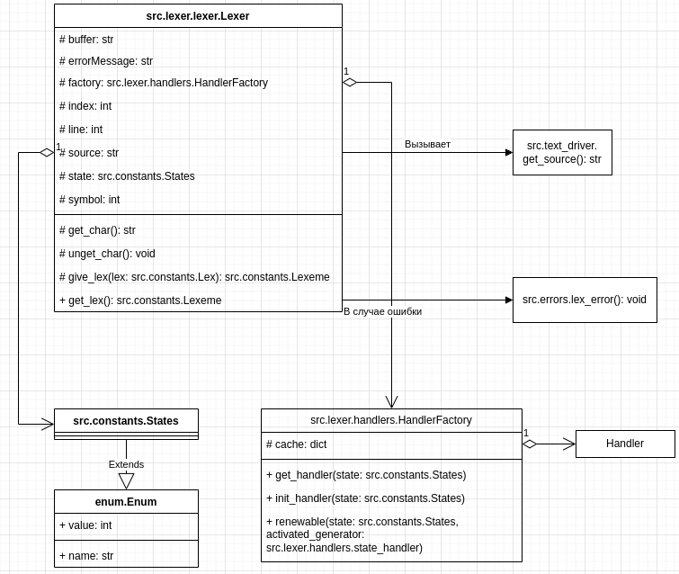{#fig:lexer_classes}

### Класс Lexer

Реализует класс лексического анализатора. Входные данные отсутствуют.

Перед началом работы требует вызов функции src.text_driver.get_source драйвера исходного текста. 

Поля:
- buffer: накапливающийся буфер лексемы;
- errorMessage: сообщение об ошибке, использующееся в конце разбора неопределённой лексемы;
- factory: объект класса HandlerFactory, выдаёт соответствующий генератор обработки текущего состояния;
- index: индекс символа в строке source;
- source: исходный текст;
- state: текущее состояние.

Lexer использует класс src.lexer.handlers.HandlerFactory, о чём подробнее будет описано в подразделе детальной разработки алгоритмов отдельных подзадач.

Методы:

- get_char: возвращает очередной символ исходного текста;
- unget_char: возвращается к предыдущему символу;
- give_lex: принимает тип лексемы, выдаёт объект src.constants.Lexeme;
- get_lex: генератор, выдаёт очередную лексему.

В случае ошибки вызывается метод src.errors.lex_error, останавливающий работу программы.

Лексический анализатор работает на базе конечного автомата, у него существует множество состояний, значения которых описываются классом src.constants.States.

Для каждого состояния, за исключением STATE_NULL существуют обработчики.

Обработчики состояний:

- state_start_handler;
- state_identificator_handler;
- state_separator_equals_handler;
- state_separator_lt_handler;
- state_separator_gt_handler;
- state_separator_or_handler;
- state_separator_and_handler;
- state_separator_assignment_handler;
- state_separator_comment_handler;
- state_separator_not_handler;
- state_number_bin_handler;
- state_letter_b_handler;
- state_letter_d_hander;
- state_letter_e_hander;
- state_letter_h_handler;
- state_letter_o_handler;
- state_number_oct_handler;
- state_number_dec_handler;
- state_number_hex_handler;
- state_fractional_handler;
- state_number_order_handler;
- state_er_handler.

Обработчик состояния это генератор, который принимает символ и возвращает либо новое состояние, либо лексему и новое состояние, либо сообщение об ошибке и новое состояние.
Реализован механизм пересоздания обработчиков, о чём упоминается в подразделе детальной разработки алгоритмов отдельных подзадач.

## Синтаксический анализатор

Синтаксический анализатор также является и семантическим анализатором.

Диаграмма классов синтаксического анализатора приведена на Рисунке [-@fig:parser_classes].

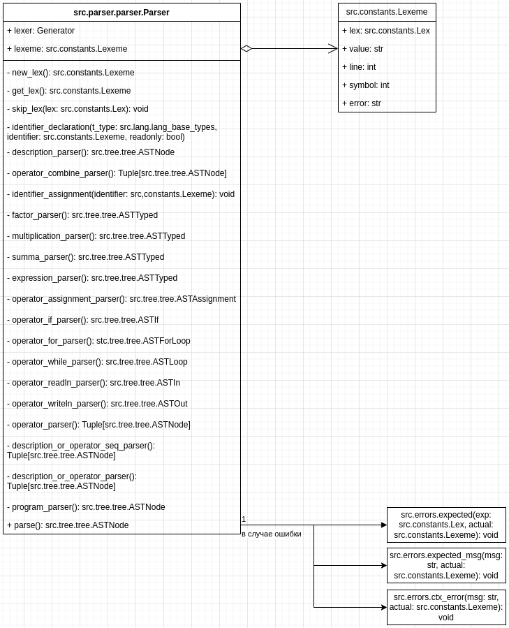{#fig:parser_classes}

Для инициализации объекта класса необходим объект лексического анализатора.

Методы:
- new_lex: запрашивает у лексического анализатора новую лексему и возвращает её;
- get_lex: возвращает текущую лексему;
- skip_lex: принимает тип лексемы, вызывает метод new_lex и проверяет тип новой лексемы на соответствие переданному агрументу, в случае несоответствия вызывает функцию expected.

Все методы, заканчивающиеся на "_parser" распознают соответствующий названию метода блок программы.

- description_parser: распознаёт объявление переменной;
- operator_combine_parser: распознаёт комбинированный оператор;
- factor_parser: парсер значения (число или переменная);
- multiplication_parser: парсер слагаемого;
- summa_parser: парсер множителя;
- expression_parser: парсер выражения;
- operator_assignment_parser: парсер оператора присваивания;
- operator_if_parser: парсер условного оператора;
- operator_for_parser: парсер цикла со счётчиком;
- operator_while_parser: парсер цикла с предусловием;
- operator_readln_parser: парсер оператора ввода;
- operator_writeln_parser: парсер оператора вывода;
- operator_parser: парсер оператора;
- description_or_operator_seq_parser: парсер последовательности объявлений или операторов;
- description_or_operator_parser: парсер объявления или оператора;
- program_parser: парсер программы;
- parse: метод разбора исходного кода всей программы.

Все приведённые выше методы, заканчивающиеся на "_parser", не требуют аргументов.

Также на диаграмме можно обнаружить ещё несколько неупомянутых методов, но о них и о возвращаемых значениях приведённых выше методов будет сказано в следующем подразделе.

## Семантический анализатор

Расширенная диаграмма классов семантического анализатора и по совместительству генератора абстрактного дерева синтаксиса приведена на Рисунке [-@fig:semantic_classes].

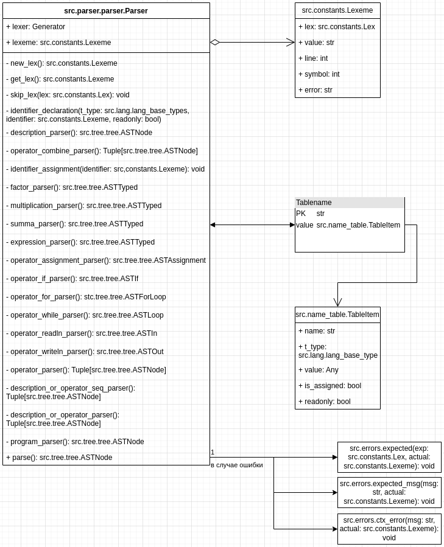{#fig:semantic_classes}

Рассмотрим парсер более подробно:

Все методы, заканчивающиеся на "_parser" возвращают узел дерева разбора, таким образом, что в методе "parse" мы получаем полноценное дерево всей программы.

Метод identifier_declaration заносит идентификатор в текущую область видимости, принимает на вход: тип данных, асоциированный с переменной, лексему идентификатора, логическое значение, логическое значение, определяющее, является ли переменная переменной, доступной только для чтения.

Метод identifier_assignment находит идентификатор в таблице имён и устанавливает поле is_assigned в значение истины, входные данные — объект лексемы.

Абстрактное синтаксическое дерево рассматривается подробнее в подразделе структурной организации данных.

У языка строгая типизация, поэтому некоторые методы отвечают за проверку типов.

Метод operator_assignment_parser проверяет, объявлена ли переменная, не является ли переменная переменной, доступной только для чтения, а также соответствие типа переменной и присваемого выражения, после чего вызывает метод identifier_assignment.

Метод identifier_declaration вызывает функцию src.parser.name_table.new_name, которая в случае повторного объявления сообщит об ошибке.

Методы factor_parser, multiplication_parser, summa_parser, expression_parser проверяют на соответствие типов подвыражений слева и справа относительно лексемы операции в соответствии с правилами, определёнными спецификацией языка (см. Приложение Д).

Метод operator_for_parser инициализирует переменную-счётчик выражением целочисленного типа.

## Драйвер исходного текста

Функция src.text_driver.setup_source: принимает в качестве аргумента путь к файлу с исходным кодом программы на модельном языке, проверяет расширение файла, вызывает функцию read_file и устанавливает значение переменной _is_set в значение истины.

Функция src.text_driver.read_file: принимает в качестве аргумента путь к файлу, считывает файл, заменяя табуляцию на четыре проблела, заполняет массив _lines и возвращает содержимое файла в качестве строки.

Функция src.text_driver.highlight: принимает номер строки и номер символа в строке, подсвечивает данное место.

Функция src.text_driver.get_source: возвращает значение переменной _source.

Функция get_filename: возвращает значение переменной _filename.

## Сообщения об ошибках

Функция src.errors.error: принимает на вход сообщение об ошибке, номер строки, номер символа в строке, код завершения программы. Печатает ошибку, вызывает функцию src.text_driver.highlight драйвера исходного текста и завершает работу программы с соответствующим кодом завершения.

Функция src.errors.lex_error: принимает объект класса лексемы, формирует сообщение о лексической ошибке, вызывает функцию src.errors.error.

Функция src.errors.expected: принимает тип ожидаемой лексемы и объект фактической лексемы, формирует сообщение о синтаксической ошибке и вызывает функцию src.errors.error.

Функция src.errors.expected_msg: аналогична src.errors.expected, только вместо типа ожидаемой лексемы принимает сообщение об ошибке.

Функция src.errors.ctx_error: принимает сообщение об ошибке и объект лексемы, формирует сообщение о контекстной ошибке и вызывает функцию src.errors.error.

## Трансляторы

Функции src.python_translator.translator.translate и src.cpp_translator.translator.translate: принимает корневой узел абстрактного синтаксического дерева типа src.tree.tree.ASTNode, возвращают строку с программой на целевом языке.

Функции src.python_translator.translator.translate_expression и src.cpp_translator.translator.translate_expression: принимают узел абстрактного синтаксического дерева типа src.tree.tree.ASTTyped, соответствующий выражению и возвращают строку с его эквивалентом на целевом языке с расставленными скобками.

Функции src.python_translator.translator.translate_operator и src.cpp_translator.translator.translate_operator принимают узел абстрактного синтаксического дерева типа src.tree.tree.ASTNode, соответствующий оператору и возвращает строку с кодом программы на целевом языке, соответствующую этому оператору.

# Структурная организация данных

Наиболее частоиспользуемые типы данных в данной программной системе — это класс лексемы и класс типа лексемы, они приведены на Рисунке [-@fig:lexeme].

{#fig:lexeme}

Класс src.constants.Lex, определяющий тип лексемы является наследником класса enum.Enum и его экземпляр может иметь одно из следующих мнемонических значений — (KEYWORD_BEGIN, KEYWORD_BOOL, KEYWORD_ELSE, KEYWORD_END, KEYWORD_FALSE, KEYWORD_FLOAT, KEYWORD_FOR, KEYWORD_IF, KEYWORD_INT, KEYWORD_NEXT, KEYWORD_READLN, KEYWORD_STEP, KEYWORD_TO, KEYWORD_TRUE, KEYWORD_WHILE, KEYWORD_WRITELN, IDENTIFIER, NUMBER_BIN, NUMBER_OCT, NUMBER_DEC, NUMBER_HEX, NUMBER_FRACTIONAL, SEPARATOR_AND, SEPARATOR_ASSIGNMENT, SEPARATOR_DIVISION, SEPARATOR_EQUALS, SEPARATOR_GT, SEPARATOR_GTE, SEPARATOR_LEFT_BRACKET, SEPARATOR_LEFT_FIGURE_BRACKET, SEPARATOR_LT, SEPARATOR_LTE, SEPARATOR_MINUS, SEPARATOR_MULTIPLICATION, SEPARATOR_NOT, SEPARATOR_NOT_EQUALS, SEPARATOR_OR, SEPARATOR_PLUS, SEPARATOR_RIGHT_BRACKET, SEPARATOR_RIGHT_FIGURE_BRACKET, SEPARATOR_SEMICOLON, SEPARATOR_COMMA, UNRESOLVED, EOF).

Класс src.constants.States, опеределяющий состояния лексического анализатора, также является наследником класса enum.Enum и предоставляет следующие значения — (ER, START, IDENTIFIER, NUMBER_BIN, NUMBER_OCT, NUMBER_DEC, NUMBER_HEX, NUMBER_ORDER, FRACTIONAL, LETTER_B, LETTER_D, LETTER_E, LETTER_H, LETTER_O, SEPARATOR_EQUALS, SEPARATOR_OR, SEPARATOR_AND, SEPARATOR_ASSIGNMENT, SEPARATOR_NOT, SEPARATOR_LT, SEPARATOR_GT, SEPARATOR_COMMENT, STATE_NULL).

Разделители лексем представлены двумя кортежами.

Кортеж BASE_SEPARATORS включает пробельный символ, табуляцию и перенос строки.
Кортеж SEPARATORS включает кортеж BASE_SEPARATORS и следующие символы: "(", ")", "!", "=", "<", ">", "+", "-", "|", "*", "/", "&", "{", "}", ":", ";", ",".

Каждый из генераторов в файле src.lexer.handlers, заканчивающийся на "_handler" принимает символ типа str, возвращает либо новое состояние типа src.constants.States, либо кортеж из пары (src.constants.Lex, src.constants.States), что означает распознанную лексему, либо список из пары (str, src.constants.States), что означает, что при распознавании произошла ошибка.

Cуществует хэш-таблица HANDLERS, ключи которой соответствуют всем возможным значениями src.constants.States, а значения соответствуют ссылкам на генераторы-обработчики этих состояний.

Семантический анализатор использует таблицу имён, описываемую диаграммой на Рисунке [-@fig:name_table].

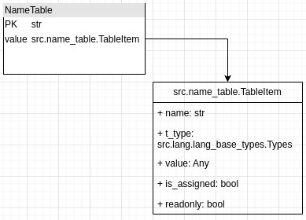{#fig:name_table}

В языке предусмотрены три типа (целочисленный, вещественный и логический), принадлежность к типу определяется классом src.lang.lang_base.types.Types, являющимся наследником от Enum и имеющий значения (int, float, bool).

Классы src.lang.lang_base_types.Integer, src.lang.lang_base_types.Float и src.lang.lang_base_types.Boolean являются классами-оболочками для значений типов данных и реализуют важный статический метод from_string, позволяющий отобразить значение типа на модельном языке в значение на языке Python без потерь, а также осуществить перевод целых чисел из различных систем счисления в десятичную с помощью встроенные в язык реализации средств.

Диаграмма классов-оболочек типов представлена на Рисунке [-@fig:types].

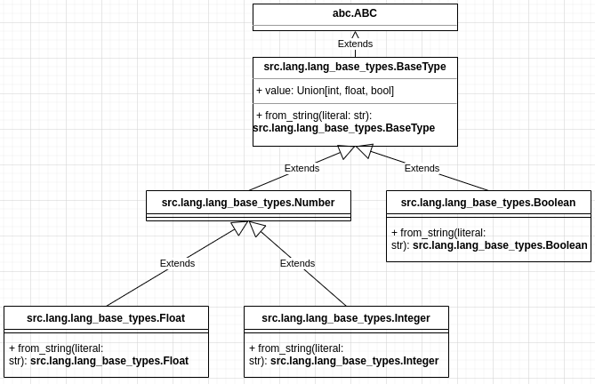{#fig:types}

Предусмотрены 13 различных операций, одна из которых появляется только в ходе оптимизации. Для их описания используется класс src.lang.lang_base_types.BinOperations, наследующийся от enum.Enum и имеющий значения (sum, diff, mul, div, alt, con, eq, neq, gt, gte, lt, lte, mod).

Абстрактное синтаксическое дерево имеет разные виды узлов, для опеределения типа узла используется класс src.tree.tree.ASTType, наследующийся от enum.Enum и определяющий следующие значения (ASSIGNMENT, IF, Loop, IN, OUT, DECL, U_OP, BIN_OP, CONST, VAR, ForLoop).

Диаграмма классов абстрактного синтаксического дерева представлена на Рисунках [-@fig:ast_1] - [-@fig:ast_2].

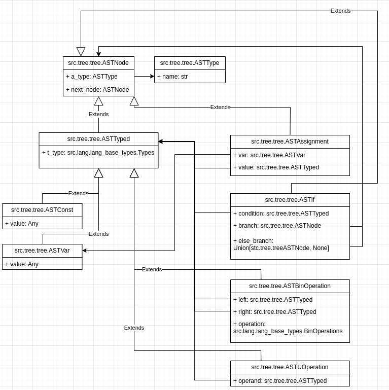{#fig:ast_1}

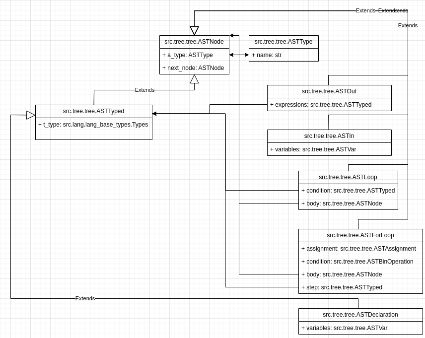{#fig:ast_2}

В файле src.text_driver.py используются следующие данные:
- _source: str - исходный код программы;
- _lines: List[str] - массив строк исходного кода программы;
- _is_set: bool - логическое значение, соответствующее готовности программы к дальнейшей обработке;
- _filename: str - имя обрабатываемого файла с исходным кодом программы.

## Спецификация входных данных

Работа с данным программным средством производится через командную строку.

Входные данные: текстовый файл с расширением ".leo", опциональный флаг "-v", опциональный флаг "-h", опциональный флаг "-t" и одно из ("py", "cpp"), опциональный флаг "-o" и имя выходного файла.

## Спецификация выходных данных

Выходные данные: Версия программного средства, справка о работе командного средства, файл с оттранслированной программой на язык c++, файл с оттранслированной программой на язык Python, оттранслированная программа на язык c++, оттранслированная программа на язык Python, сообщение об ошибке.

# Разработка алгоритма решения задачи

Задача решается в два прохода и имеет необходимость в нескольких дополнительных действиях до и после проходов.

Процедуры перед началом прохода:

- подготовка исходных данных, вызов функции setup_source;
- создание объекта класса Lexer;
- создание объекта класса Parser с передачей объекта класса Lexer в качестве аргумента.

Первый проход:

- вызов метода parse объекта класса Parser, который требует от лексера новые лексемы и осуществляет разбор исходной программы с одновременным построением дерева абстрактного синтаксиса.

Второй проход:

- вызов соответствующего метода трансляции (src.python_translator.translator.translate или src.cpp_translator.translator.translate) и получение программы на целевом языке.

Процедуры после проходов:

- сохранение в файл или печать программы в консоль.

## Укрупненная схема алгоритма программного средства

Укрупненная схема алгорита приведена на Рисунках [-@fig:alg1] - [-@fig:alg3].

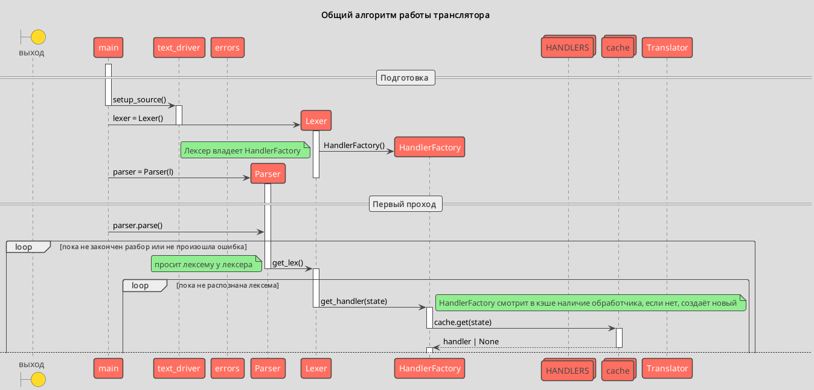{#fig:alg1}

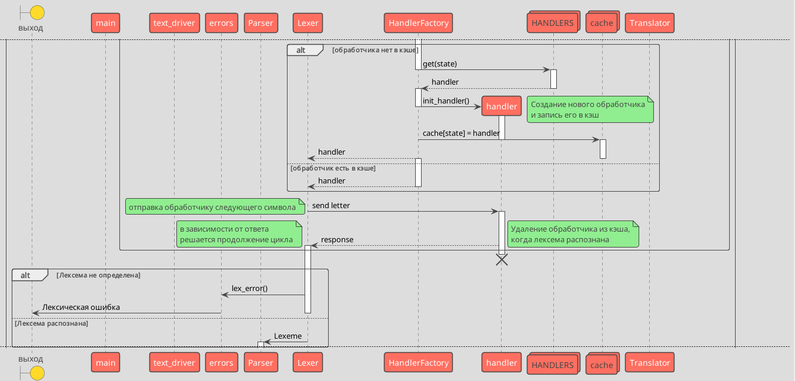{#fig:alg2}

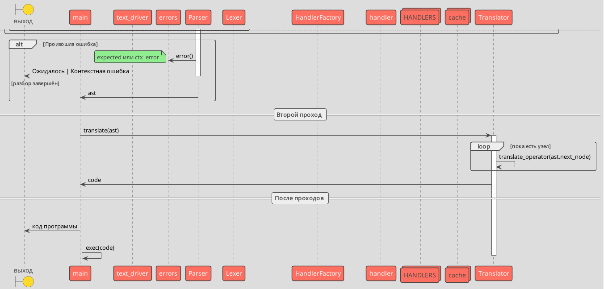{#fig:alg3}

## Детальная разработка алгоритмов отдельных подзадач

Перед началом работы программы пользователю необходимо ввести название файла с исходным кодом программы на модельном языке.

Задача инициализации:

Перед началом распознавания была выявлена необходимость в создании отдельного модуля для чтения данных из файла, а также хранения списка строк для подсветки мест, в которых может произойти ошибка.

Инициализация происходит посредством вызова функции setup_source. Функция проверяет название файла на валидность, вызывает функцию чтения файла, которая заполняет строковое поле _source с исходным кодом программы и список строк _lines, предварительно заменяя символ табуляции на 4 пробела для корректной подсветки ошибок.

После этого создаётся объект класса Lexer, при инициализации он вызывает функцию get_source, которая выдаёт ошибку в случае, если предварительно не была вызвана функция get_source. Множество полей объекта класса инициализируются начальными значениями, но особое внимание стоит обратить на создание объекта класса HandlerFactory.

После создания объекта класса лексического создаётся объект класса синтаксического анализатора с передачей ему в качестве аргумента созданного лексического анализатора. Синтаксический анализатор использует метод get_lex лексического анализатора. Это генератор, оборачиваемый парсером в итератор, для которого по мере необходимости вызывается функция next.

После того, как необходимые объекты созданы начинается парсинг.

Алгоритм работы генератора get_lex класса Lexer.

Данный метод работает на базе конечного автомата, при этом используя бесконечный цикл. Для грамматики со сложностью, соответствующей исходной сложно было бы обойтись без метода unget_char, при условии использования такого цикла.

В бесконечном цикле вызывается метод get_char, результат работы которого записывается в переменную char, это очередной символ исходного текста программы. Если прочитать символ не удалось, генератор отправляет лексему конца файла и завершает свою работу, выходя из цикла.
Далее у поля _factory вызывается метод get_handler с параметром текущего состояния лексического анализатора, хранящегося в поле _state. Метод возвращает обработчик для переданного состояния. Метод get_handler сначала ищет существующий объект обработчика в кэше, реализованном хэш-таблицей и если его там не оказалось, создаётся новый с помощью хэш-таблицы HANDLERS. Созданный генератор инициализируется и оборачивается в генератор-делегатор renewable, задача которого состоит в том, что если новое состояние, которое вернёт обработчик будет отличаться от того, которое он обрабатывает, в кэш запишется новый объект такого генератора, для того, чтобы его состояние снова стало исходным. Обработчики хоть и обрабатывают состояния, однако сами могут иметь свои подсостояния, например обработчик состояния символа двойного равенства имеет два состояния, в первом он ожидает второй символ '=', во втором он выдаёт лексему, а первый символ '=' обрабатывается в состоянии START. Каждый обработчик отдаёт лексему только тогда, когда получит символ, не соответствующей ей, после чего выполняется метод unget_char. Например при обработке строки вида "== ", лексема символа равенства будет выдана после обработки символа проблела, после чего в цикле считываться следующий символ. Для того, чтобы следующий символ был пробелом, на месте которого может быть значащий разделитель вызывается метод unget_char.

После получения нужного обработчика ему отправляется следующий символ. Если ответ от обработчика соответствует новому состоянию, то состояние меняется, если это кортеж из типа лексемы и нового состояния, то необходимо дополнительно отдать лексему, а если это список из сообщения об ошибке и нового состояния, то сообщение запоминается и генератор переходит в состояние обработки ошибки, ожидая символ разделитель, также меняя состояние.

Если символ не принадлежит базовым разделителям (пробел, табуляция, перенос строки, он накапливается в поле buffer). Если обработчик отдал лексему идентификатора, то проверяется, является ли она ключевым словом. Одновременно с этим высчитываются номер строки и номер символа в строке для того, чтобы ассоциировать с ними лексему.

Метод give_lex отдаёт лексему с учётом накопленного буфера и всех ассоциированных значений с лексемой (тип, значение, номер строки, номер символа в строке, сообщение об ошибке). Если тип лексемы UNRESOLVED, вызывается функция lex_error. Иначе get_lex отдаёт лексему, сохраняя своё состояние и поток управления возвращается к тому, кто её запросил, то есть синтаксическому анализатору.

Алгоритм работы класса Parser.

Класс одновременно анализирует программу на синтаксическую и семантическую корректность, а также строит абстрактное синтаксическое дерево.

Для реализации трансляции на Python возникла необходимость в создании переменной вида только для чтения. Дело в цикле for, в Python ему соответствует конструкция "for i in range", это не позволяет изменять переменную, ведь каждую итерацию её значение определяется заново, также эту переменную разрешено использовать только в теле цикла. Для помощи в проверки программы на семантическую корректность была создана таблица имён, это хэш-таблица, элемент которой класс TableItem.

Таблица имён представляет из себя список хэш-таблиц, каждая из которых соответствует области видимости. Области видимости были введены только для того, чтобы объявленная в цикле for переменная не могла быть использована вне этого цикла, ведь её значение различно в реализациях на Python и на c++, однако это не означает, что переменную можно объявить как локальную, перекрыв глобальную, ведь и в таком случае поведение будет отличаться в зависимости от реализации.

Метод parse начинает разбор, реализованный алгоритмом рекурсивного спуска. Каждый метод, заканчивающийся на "_parser" соответствует правилам в грамматике языка. Метод parse_program парсит конструкцию, соответствующую правилу "<программа>", description_or_operator_parser конструкцию, соответствующую правилу "(<описание> | <оператор>)", остальные методы аналогичны в данном соответствии. Каждый метод возвращает узел абстрактного синтаксического дерева, реализованного на базе односвязного списка, но имеющим ответвления.

Стоит отметить следующие детали:

Метод description_parser (парсер оператора объявления) вызывает метод indentifier_declaration, который вызывает функцию new_name, которая создаёт запись о переменной в таблице имён, а в случае, если переменная там уже есть выдаёт контекстную ошибку.

Метод operator_combine_parser (парсер комбинированного оператора) возвращает два узла, начальный и конечный, так как множество операторов собираются в односвязный список.

Метод operator_assignment_parser (парсер оператора присваивания) проверяет идентификатор, к которому производится присваивание на наличие в таблице имён, если его там нет, выдаёт контекстную ошибку о том, что переменная не объявлена, если запись найдена, но переменная доступна только для чтения, выдаёт контекстную ошибку, если тип присваемого выражения отличается от типа переменной, также выдаёт ошибку.

Метод operator_readln_parser (парсер оператора ввода) также осуществляет проверки на предварительное определение переменной и на принадлежность переменной к классу переменных, доступных только для чтения.

Метод operator_for_parser (парсер цикла со счётчиком) самый сложный, ведь ему необходимо объявить переменную-счётчик в новой области видимости с параметром только для чтения, проверить тип переменной, присваемого выражения, а также выражения конца цикла и выражения после ключевого слова "step" на соответствие целочисленному типу. В конце цикла for блок области видимости закрывается и переменная-счётчик становится недоступной.

Методы expression_parser, summa_parser, multiplication_parser, factor_parser проверяют на соответствие типов подвыражений слева и справа от лексемы типа операции на предмет соответствия спецификации языка (Приложение Д).

После того, как программа распознана, а дерево построено производится одна единственная оптимизация, выражение вида "i / j * j == i" заменяется на выражение вида "i % j == 0" на уровне синтаксического дерева, при условии, что i и j объявлены как переменные целочисленного типа.

После того, как оптимизация была проведена, выполняется трансляция. Функция translate импортирует стандартную библиотеку в случае с c++, и для обоих целевых языков формирует объявление функции main. Далее построение происходит напрямую по полям next_node верхнеуровневых узлов. Для каждого узла вызывается функция translate_operator, которая переводит семантику оператора на целевой язык. Функция translate_expression вызывается функцией translate_operator и переводит выражение на целевой язык, расставляя скобки.

После трансляции в зависимости от запроса пользователя программа либо выполняется «на месте» при помощи встроенной в язык реализации команды exec, либо выводится в консоль, либо сохраняется в файл.

# Установка и эксплуатация программного средства

## Условия эксплуатации

Программный продукт требуется использовать на поддерживающихся устройствах в их диапазоне поддерживающихся температур эксплуатации и хранения.

## Требования к составу и параметрам технических средств

Для пользовательских устройств:

Пользовательское устройство должно иметь одну из следующих операционных систем и соответствующие для неё требования.

1. Windows:

- windows 10 или более поздней версии либо Windows Server 2016 или более поздней версии;
- процессор Intel Pentium 4, а также его аналоги или более поздние их версии с поддержкой SSE3.

2. MacOS:

- macOS High Sierra 10.13 или более поздней версии.

3. Linux:

- ubuntu 18.04 (64-разрядная версия) или более поздней версии;
- debian 10 или более поздней версии, openSUSE 15.2 или более поздней версии;
- fedora Linux 32 или более поздней версии.

4. Android:

− android 7.0 Nougat или более поздней версии.

Также для работы системы требуются:

- от 4-х мегабайт свободного дискового пространства;
- от 250 мегабайт свободной оперативной памяти.

## Установка программного средства

Для установки программного средства необходимо установить Python версии 3.8 и выше, после чего скачать исходный код программы.

Скачать исходный код можно по ссылке [Исходный код программы](https://github.com/Papr1ka/TFL).

# Работа с программным средством

Программное средство предусматривает следующие сценарии использования:

1. Интерпретация программы на языке Leo.
2. Трансляция программы на языке Leo.
3. Получение справки об использовании.
4. Получение информации о версии программной системы.

Программа, реализующая программный интерфейс называется leo.py в каталоге course.

## Интерпретация программы на языке Leo.

Для данного сценария использования предусматривается следующая конструкция обращения "python leo.py название_программы.leo".

При отсутствии файла или отличном от ".leo" расширении будет выведено сообщение как на Рисунке [-@fig:invalid_path].

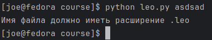{#fig:invalid_path}

В случае успеха программа начнёт своё выполнение. Имеют место ошибки, связанные с некорректным вводом данных для самой программы, например ввод строки для ожидаемого программой целого числа. Они будут обработаны самим Python, например как на рисунке [-@fig:invalid_input].

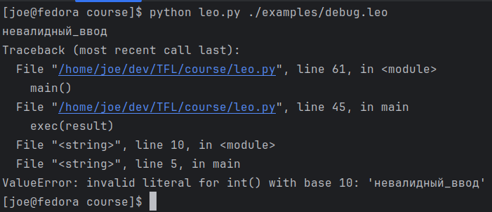{#fig:invalid_input}

## Трансляция программы на языке Leo

Для данного сценария использования предусматривается следующая конструкция обращения "python leo.py название_программы.leo -t {py, cpp} -o {название_выходной_программы, std}", где "{py, cpp}" означает одно из "py", "cpp". "py" соответствует трансляции на Python, "cpp" на c++.

При отсутствии файла или отличном от ".leo" расширении будет выведено сообщение как на Рисунке [-@fig:invalid_path].

При выборе варианта std программа будет выведена в консоль.

Иначе программа на целевом языке будет записана в файл.

## Получение справки об использовании

Справка будет выведена при обращении "python leo.py -h" или при неправильном вводе.

Результат вывода справки изображён на Рисунке [fig:help].

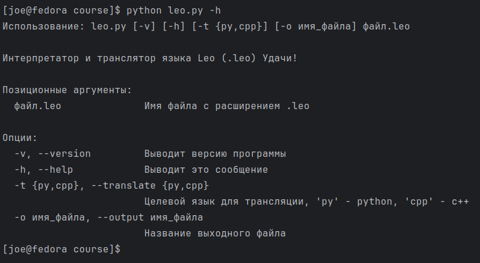{#fig:help}

## Получение версии программной системы

Версия будет выведена при обращении "python leo.py -v".

Результат вывода справки изображён на Рисунке [fig:version].

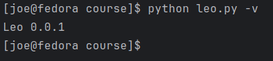{#fig:version}

# Заключение

В результате выполнения данной курсовой работы была решена задача создания языка программирования на базе исходной грамматики, а также выполнены следующие задачи:

- разработан лексический анализатор;
- разработать синтаксический анализатор;
- разработать семантический анализатор;
- разработать механизм обработки ошибок;
- разработать транслятор на язык Python;
- разработать транслятор на язык c++.

Разработанная система способна интерпретировать программы на языке Leo, а также транслировать их на языки Python и c++. Система позволит писать общий код для двух различных языков программирования, что значительно ускорит скорость разработки несложных вычислительных программ и использовать код на целевых языках в зависимости от наличия их компиляторов/интерпретаторов на конкретной машине.

Система имеет потенциал для добавления для различных оптимизаций, статического и динамического анализа кода, добавлению поддержки трансляции на другие языки программирования, написанию виртуальной машины и генерации кода для неё или непосредственно для соответствующих архитектур процессоров.

Также исходная грамматика поддаётся модификации и нуждается в некоторых коррекциях, а также поддержки пользовательских функций, модулей, конвертации типов, пользовательских структур данных и разбиению кода программы на несколько файлов.

Исходный код готовой программы можно загрузить по ссылке [исходный код программы](https://github.com/Papr1ka/TFL.git).

# Список использованных источников

1. Сергей Свердлов Конструирование компиляторов 2005. - ISBN 978-3-659-71665-2.

2. Никлаус Вирт Построение компиляторов? Москва 2010. - ISBN 978-5-94074-585-3.

1. Ахо, А.В. Компиляторы: принципы, технологии и инструменты / А. Ахо, Р. Сети, Д. Ульман; перевод с англ. И.В. Красикова и др. - М.: Вильямс, 2001. - 767 с.: ил.; 24 см. - Библиогр.: с. 742-763. - Предм. указ.: 764-767. - 5000 экз. - ISBN 5-8459-0189-8 (в пер.).
2. Власенко, А.В. Теория языков программирования и методы трансляции: учеб. пособие / А.В. Власенко, В.И. Ключко; М-во образования и науки РФ, ГОУ ВПО «Кубан. гос. технол. ун-т». - Краснодар: Изд-во КубГТУ, 2004. - 119 с.: ил.; 21 см. - Библиогр.: с. 118. - 75 экз. - ISBN 5-8333-0176-9.
3. Гавриков, М.М. Основы конструирования компиляторов: учеб. пособие / М.М. Гавриков, А.Н. Иванченко, Д.В. Гринченков; М-во общ. и проф. образования РФ, Новочеркас. гос. техн. ун-т. – Новочеркасск: НГТУ, 1997. - 80 с.: ил.; 20 см. - Библиогр.: с. 79. – 75 экз. - ISBN 5-88998-059-9.
4. Гордеев, А.В. Системное программное обеспечение: учеб. для вузов / А. Ю. Молчанов. - 3-е изд. - СПб.: Питер, 2010. - 398 с.: ил. - (Учебник для вузов). - Указ. лит.: с. 387-390. - Алф. указ.: с. 391-397. - ISBN 978-5-49807-153-4.
5. Ишакова, Е.Н. Теория языков программирования и методов трансляции: учебное пособие / Е.Н. Ишакова. – Оренбург: ИПК ГОУ ОГУ, 2007. – 137 с. - ISBN 978-5-7410-0712-9.
6. Ишакова, Е.Н. Разработка компиляторов: Методические указания к курсовой работе / Е.Н. Ишакова. - Оренбург: ГОУ ОГУ, 2005. – 50 с.
7. Карпов, В.Э. Классическая теория компиляторов: учеб. пособие / В.Э. Карпов; М-во образования РФ, Моск. гос. ин-т электрон. и математики (техн. ун-т). - М.: МГИЭМ, 2002. - 78 с : ил.; 20 см. - Библиогр.: с. 78. - 150 экз. - ISBN 5-230-16344-5.
8. Компаниец, Р.И. Системное программирование: основы построения трансляторов: учеб. пособие для высших и средних учебных заведений / Р.И. Компаниец, Е.В. Маньков, Н.Е. Филатов. - СПб.: Корона принт, 2000. - 254, [1] с.: ил.; 23 см. - Библиогр.: с. 255. - 3000 экз. - ISBN 5-7931-0124-1.
9. Мозговой, М.В. Классика программирования: алгоритмы, языки, автоматы, компиляторы. Практический подход / М.В. Мозговой. – СПб.: Наука и техника, 2006. - 320 с.: ил.; 24 см. - 3000 экз. - ISBN 5-94387-224-8.
10. Пратт, Т. Языки программирования: разработка и реализация / Т. Пратт, М. Зелковиц; пер. с англ. - СПб.: Питер принт, 2002. - 688 с.: ил.; 24 см. - Библиогр.: с. 669-674. - Алф. указ.: с. 675-688. - Загл. и авт. ориг.: Programming languages / Terrence W. Pratt, Marvin V. Zelkowitz. - 4000 экз. - ISBN 5-318-00189-0 (в пер.).

# Приложения

Приложение А — Текст программы

Приложение Б — Контрольный пример

Приложение В — Сообщения об ошибках

Приложение Д — Спецификация языка

# Приложение А — Текст программы

Исходный код программы можно загрузить по ссылке [исходный код программы](https://github.com/Papr1ka/TFL.git).

Код программы приведён в Листингах [-@lst:a_1] - [-@lst:a_20].

```{#lst:a_1 .txt caption="leo.py"}
import argparse
import pathlib

import src


class RussianHelpFormatter(argparse.HelpFormatter):
    def add_usage(self, usage, actions, groups, prefix=None):
        if prefix is None:
            prefix = 'Использование: '
            return super(RussianHelpFormatter, self).add_usage(
                usage, actions, groups, prefix)
def main():
    DESCRIPTION = """Интерпретатор и транслятор языка Leo (.leo) Удачи!"""

    parser = argparse.ArgumentParser(description=DESCRIPTION, formatter_class=RussianHelpFormatter, add_help=False)
    parser._positionals.title = "Позиционные аргументы"
    parser._optionals.title = "Опции"
    parser.add_argument('-v', '--version', action='version',
                        version=f'Leo {src.__version__}', help="Выводит версию программы")
    parser.add_argument('-h', '--help', action='help', default=argparse.SUPPRESS,
                        help='Выводит это сообщение')
    parser.add_argument("target", type=pathlib.Path, help="Имя файла с расширением .leo", metavar="файл.leo")
    parser.add_argument("-t", "--translate", type=str, choices=['py', 'cpp'], default="py",
                        help="Целевой язык для трансляции, 'py' - python, 'cpp' - c++")
    parser.add_argument("-o", "--output", type=str, help="Название выходного файла", metavar="имя_файла")
    namespace = parser.parse_args()

    try:
        src.setup_source(namespace.target)
    except ValueError as E:
        print(E.args[0])
        exit(4)
    except FileNotFoundError as E:
        print("Файл не найден")
        exit(5)

    lexer = src.Lexer()
    parser = src.Parser(lexer)
    ast = parser.parse()

    if namespace.output is None:
        result = src.py_translate(ast)
        exec(result)
    else:
        if namespace.translate == "py":
            result = src.py_translate(ast)
        else:
            result = src.cpp_translate(ast)

        if namespace.output == "std":
            print(result)
        else:
            with open(namespace.output, "w") as file:
                file.writelines(result)

    print("Leo: Успешно")

if __name__ == "__main__":
    main()
```

```{#lst:a_2 .txt caption="src/text_driver.py"}
import os
import pathlib
from typing import Union

_source = ""
_lines = []
_is_set = False
_filename = "Интерактивный"


def read_file(filename: pathlib.Path) -> str:
    global _lines
    with open(os.path.abspath(os.path.relpath(filename))) as file:
        _lines = file.readlines()
    if not _lines:
        _lines = [""]
    stream = "".join(_lines) + " "
    stream = stream.replace("\t", "    ")  # замена табов на 4 пробела
    return stream


def highlight(line: int, symbol: int):
    if len(_lines) > line - 1:
        content: str = _lines[line - 1]
        if content.endswith("\n"):
            print(content, end="")
        else:
            print(content)
        for i in range(symbol - 1):
            print(" ", end="")
        print("^")


def setup_source(filename: Union[pathlib.Path, str]):
    global _source, _is_set, _filename
    if isinstance(filename, str):
        filename = pathlib.Path(filename)

    if filename.name.endswith(".leo"):
        _source = read_file(filename)
        _filename = filename.name
    else:
        raise ValueError("Имя файла должно иметь расширение .leo")
    _is_set = True


def get_source() -> str:
    if not _is_set:
        raise NotImplementedError("Не вызван setup_source")
    return _source


def get_filename() -> str:
    return _filename
```

```{#lst:a_3 .txt caption="src/errors.py"}
from .constants import Lex, Lexeme, semantic
from .text_driver import highlight, get_filename

first_string = 'Файл "{}", Строка {}, Символ {}'


def error(message: str, line: int, symbol: int, exit_code: int):
    print(first_string.format(get_filename(), line, symbol))
    highlight(line, symbol)
    print(message)
    exit(exit_code)


def lex_error(lex: Lexeme):
    error(f"Лексическая ошибка: '{lex.value}' - {lex.error}", lex.line, lex.symbol, 1)


def expected(exp: Lex, actual: Lexeme):
    error(f"Синтаксическая ошибка: ожидалось - '{semantic.get(exp)}', получено - {semantic.get(actual.lex)}",
          actual.line, actual.symbol, 2)


def expected_msg(msg: str, actual: Lexeme):
    error(f"Синтаксическая ошибка: ожидалось - '{msg}', получено - {semantic.get(actual.lex)}",
          actual.line, actual.symbol, 2)


def ctx_error(msg: str, lex: Lexeme):
    error(f"Контекстная ошибка: '{lex.value}' - {msg}",
          lex.line, lex.symbol, 3)
```

```{#lst:a_4 .txt caption="src/constants.py"}
from dataclasses import dataclass
from enum import Enum


class States(Enum):
    # Рабочие состояния
    ER = 0
    START = 1
    IDENTIFIER = 2
    NUMBER_BIN = 3
    NUMBER_OCT = 4
    NUMBER_DEC = 5
    NUMBER_HEX = 6
    NUMBER_ORDER = 7
    FRACTIONAL = 10
    LETTER_B = 11
    LETTER_D = 12
    LETTER_E = 13
    LETTER_H = 14
    LETTER_O = 15

    # Разделители
    SEPARATOR_EQUALS = 17
    SEPARATOR_OR = 20
    SEPARATOR_AND = 21
    SEPARATOR_ASSIGNMENT = 22
    SEPARATOR_NOT = 32
    SEPARATOR_LT = 33
    SEPARATOR_GT = 34
    SEPARATOR_COMMENT = 35
    STATE_NULL = -1  # вспомогательное состояние, когда буфер накопился, но это не лексема (комментарий)


# Границы лексем, не накапливаемые в буфере
BASE_SEPARATORS = (
    " ",
    "\n",
    "\t",
)

# Границы лексем
SEPARATORS = (
    *BASE_SEPARATORS,
    "(",
    ")",
    "!",
    "=",
    "<",
    ">",
    "+",
    "-",
    "|",
    "*",
    "/",
    "&",
    "{",
    "}",
    ":",
    ";",
    ",",
)


class Lex(Enum):
    KEYWORD_BEGIN = 1
    KEYWORD_BOOL = 2
    KEYWORD_ELSE = 3
    KEYWORD_END = 4
    KEYWORD_FALSE = 5
    KEYWORD_FLOAT = 6
    KEYWORD_FOR = 7
    KEYWORD_IF = 8
    KEYWORD_INT = 9
    KEYWORD_NEXT = 10
    KEYWORD_READLN = 11
    KEYWORD_STEP = 12
    KEYWORD_TO = 13
    KEYWORD_TRUE = 14
    KEYWORD_WHILE = 15
    KEYWORD_WRITELN = 16

    IDENTIFIER = 17

    NUMBER_BIN = 18
    NUMBER_OCT = 19
    NUMBER_DEC = 20
    NUMBER_HEX = 21
    NUMBER_FRACTIONAL = 22

    SEPARATOR_AND = 23
    SEPARATOR_ASSIGNMENT = 24
    SEPARATOR_DIVISION = 25
    SEPARATOR_EQUALS = 26
    SEPARATOR_GT = 27
    SEPARATOR_GTE = 28
    SEPARATOR_LEFT_BRACKET = 29
    SEPARATOR_LEFT_FIGURE_BRACKET = 30
    SEPARATOR_LT = 31
    SEPARATOR_LTE = 32
    SEPARATOR_MINUS = 33
    SEPARATOR_MULTIPLICATION = 34
    SEPARATOR_NOT = 35
    SEPARATOR_NOT_EQUALS = 36
    SEPARATOR_OR = 37
    SEPARATOR_PLUS = 38
    SEPARATOR_RIGHT_BRACKET = 39
    SEPARATOR_RIGHT_FIGURE_BRACKET = 40
    SEPARATOR_SEMICOLON = 41
    SEPARATOR_COMMA = 42

    UNRESOLVED = 0
    EOF = -1


KEYWORDS = {
    'begin': Lex.KEYWORD_BEGIN,
    'bool': Lex.KEYWORD_BOOL,
    'else': Lex.KEYWORD_ELSE,
    'end': Lex.KEYWORD_END,
    'false': Lex.KEYWORD_FALSE,
    'float': Lex.KEYWORD_FLOAT,
    'for': Lex.KEYWORD_FOR,
    'if': Lex.KEYWORD_IF,
    'int': Lex.KEYWORD_INT,
    'next': Lex.KEYWORD_NEXT,
    'readln': Lex.KEYWORD_READLN,
    'step': Lex.KEYWORD_STEP,
    'to': Lex.KEYWORD_TO,
    'true': Lex.KEYWORD_TRUE,
    'while': Lex.KEYWORD_WHILE,
    'writeln': Lex.KEYWORD_WRITELN,
}

semantic = {
    Lex.KEYWORD_BEGIN: "begin",
    Lex.KEYWORD_BOOL: "bool",
    Lex.KEYWORD_ELSE: "else",
    Lex.KEYWORD_END: "end",
    Lex.KEYWORD_FALSE: "false",
    Lex.KEYWORD_FLOAT: "float",
    Lex.KEYWORD_FOR: "for",
    Lex.KEYWORD_IF: "if",
    Lex.KEYWORD_INT: "int",
    Lex.KEYWORD_NEXT: "next",
    Lex.KEYWORD_READLN: "readln",
    Lex.KEYWORD_STEP: "step",
    Lex.KEYWORD_TO: "to",
    Lex.KEYWORD_TRUE: "true",
    Lex.KEYWORD_WHILE: "while",
    Lex.KEYWORD_WRITELN: "writeln",

    Lex.IDENTIFIER: "идентификатор",

    Lex.NUMBER_BIN: "двоичное число",
    Lex.NUMBER_OCT: "восьмиричное число",
    Lex.NUMBER_DEC: "десятичное число",
    Lex.NUMBER_HEX: "шестнадцатиричное число",
    Lex.NUMBER_FRACTIONAL: "дробное число",

    Lex.SEPARATOR_AND: "and",
    Lex.SEPARATOR_ASSIGNMENT: ":=",
    Lex.SEPARATOR_DIVISION: "/",
    Lex.SEPARATOR_EQUALS: "==",
    Lex.SEPARATOR_GT: ">",
    Lex.SEPARATOR_GTE: ">=",
    Lex.SEPARATOR_LEFT_BRACKET: "(",
    Lex.SEPARATOR_LEFT_FIGURE_BRACKET: "{",
    Lex.SEPARATOR_LT: "<",
    Lex.SEPARATOR_LTE: "<=",
    Lex.SEPARATOR_MINUS: "-",
    Lex.SEPARATOR_MULTIPLICATION: "*",
    Lex.SEPARATOR_NOT: "!",
    Lex.SEPARATOR_NOT_EQUALS: "!=",
    Lex.SEPARATOR_OR: "||",
    Lex.SEPARATOR_PLUS: "+",
    Lex.SEPARATOR_RIGHT_BRACKET: ")",
    Lex.SEPARATOR_RIGHT_FIGURE_BRACKET: "}",
    Lex.SEPARATOR_SEMICOLON: ";",
    Lex.SEPARATOR_COMMA: ",",
    Lex.EOF: "Конец файла"
}


@dataclass
class Lexeme:
    lex: Lex
    value: str
    line: int
    symbol: int
    error: str
```

```{#lst:a_5 .txt caption="src/__init__.py"}
__version__ = "0.0.1"


from src.cpp_translator import translate as cpp_translate
from src.interpreter import run
from src.lexer import Lexer
from src.parser import Parser
from src.python_translator import translate as py_translate
from src.text_driver import get_filename, setup_source
from src.tree import optimize_tree
```

```{#lst:a_6 .txt caption="src/tree/__init__.py"}
from .optimizations import *
from .tree import *
```

```{#lst:a_7 .txt caption="src/tree/optimizations.py"}
from src.lang import Integer
from src.tree.tree import *


def division_to_mod_check(ast: ASTTyped) -> Union[ASTBinOperation | None]:
    if ast.a_type == ASTType.BIN_OP and ast.operation == BinOperations.eq:
        if (ast.right.t_type == Types.int and
                ast.left.t_type == Types.int and
                ast.right.a_type == ASTType.VAR and
                ast.left.a_type == ASTType.BIN_OP and
                ast.left.operation == BinOperations.mul):
            node: ASTBinOperation = ast.left
            first_var_name = ast.right.name
            if (
                    node.right.a_type == ASTType.VAR and node.left.a_type == ASTType.BIN_OP and node.left.operation == BinOperations.div):
                second_var_name = node.right.name
                node: ASTBinOperation = node.left
                if (node.left.a_type == ASTType.VAR and node.right.a_type == ASTType.VAR):
                    if node.left.name == first_var_name and node.right.name == second_var_name:
                        return ASTBinOperation(ASTBinOperation(ast.right, ast.left.right, BinOperations.mod),
                                               ASTConst(Types.int, Integer(0)), BinOperations.eq)


def optimize_tree(ast: ASTNode):
    while ast is not None:
        optimize_one(ast)
        ast = ast.next_node


def optimize_expression(ast: ASTTyped) -> Union[ASTNode | None]:
    mod_check_operation = division_to_mod_check(ast)
    if mod_check_operation is not None:
        return mod_check_operation


def optimize_one(ast: ASTNode):
    if ast.a_type == ASTType.ASSIGNMENT:
        ast: ASTAssignment
        r = optimize_expression(ast.value)
        if r is not None:
            ast.value = r

    elif ast.a_type == ASTType.IF:
        ast: ASTIf
        r = optimize_expression(ast.condition)
        if r is not None:
            ast.condition = r
        node = ast.branch
        while node is not None:
            optimize_one(node)
            node = node.next_node
        if ast.else_branch is not None:
            node = ast.else_branch
            while node is not None:
                optimize_one(node)
                node = node.next_node

    elif ast.a_type == ASTType.Loop:
        ast: ASTLoop
        r = optimize_expression(ast.condition)
        if r is not None:
            ast.condition = r

        node = ast.body
        while node is not None:
            optimize_one(node)
            node = node.next_node

    elif ast.a_type == ASTType.ForLoop:
        ast: ASTForLoop
        r = optimize_expression(ast.step)
        if r is not None:
            ast.step = r

        r = optimize_expression(ast.assignment.value)
        if r is not None:
            ast.assignment.value = r

        r = optimize_expression(ast.condition.right)
        if r is not None:
            ast.condition.right = r

        node = ast.body
        while node is not None:
            optimize_one(node)
            node = node.next_node

    elif ast.a_type == ASTType.IN:
        pass

    elif ast.a_type == ASTType.OUT:
        ast: ASTOut
        r = optimize_expression(ast.expressions)
        if r is not None:
            ast.expressions = r

        prev = ast.expressions
        node = ast.expressions.next_node

        while node is not None:
            r = optimize_expression(node)
            if r is not None:
                prev.next_node = r

            prev = node
            node = node.next_node
```

```{#lst:a_8 .txt caption="src/tree/tree.py"}
from enum import Enum
from typing import Any, Union

from src.lang import BinOperations, RELATION_OPERATORS, Types


class ASTType(Enum):
    ASSIGNMENT = 0
    IF = 1
    Loop = 2
    IN = 3
    OUT = 4
    DECL = 5
    U_OP = 6
    BIN_OP = 7
    CONST = 8
    VAR = 9
    ForLoop = 10


class ASTNode:
    """
    Базовый узел, имеет тип узла, ссылку на следующий узел
    """
    a_type: ASTType
    next_node: Any  # ASTNode

    def __init__(self, a_type: ASTType):
        self.a_type = a_type
        self.next_node = None


class ASTTyped(ASTNode):
    """
    Типизированный узел, может быть переменной, бинарной или унарной операцией, константой
    """
    t_type: Types

    def __init__(self, t_type: Types, a_type: ASTType):
        super().__init__(a_type)
        self.t_type = t_type


class ASTConst(ASTTyped):
    """
    Константа
    """
    value: Any

    def __init__(self, t_type: Types, value: Any):
        super().__init__(t_type, ASTType.CONST)
        self.value = value


class ASTVar(ASTTyped):
    """
    Переменная
    """
    name: str

    def __init__(self, t_type: Types, name: str):
        super().__init__(t_type, ASTType.VAR)
        self.name = name


class ASTAssignment(ASTNode):
    """
    Оператор присваивания
    """
    var: ASTVar
    value: ASTTyped

    def __init__(self, var: ASTVar, value: ASTTyped):
        super().__init__(ASTType.ASSIGNMENT)
        self.var = var
        self.value = value


class ASTIf(ASTNode):
    """
    Условный оператор
    """
    condition: ASTTyped
    branch: ASTNode  # Список
    else_branch: Union[ASTNode, None]  # Список

    def __init__(self, condition: ASTTyped, branch: ASTNode, else_branch: ASTNode = None):
        super().__init__(ASTType.IF)
        self.condition = condition
        self.branch = branch
        self.else_branch = else_branch


class ASTBinOperation(ASTTyped):
    """
    Бинарная операция
    """
    left: ASTTyped
    right: ASTTyped
    operation: BinOperations

    def __init__(self, left: ASTTyped, right: ASTTyped, operation: BinOperations):
        if operation in RELATION_OPERATORS:
            super().__init__(Types.bool, ASTType.BIN_OP)
        else:
            super().__init__(left.t_type, ASTType.BIN_OP)
        self.left = left
        self.right = right
        self.operation = operation


class ASTUOperation(ASTTyped):
    """
    Унарная операция (только '!' - отрицание)
    """
    operand = ASTTyped

    def __init__(self, operand: ASTTyped, parent=None):
        super().__init__(operand.t_type, ASTType.U_OP)
        self.operand = operand


class ASTLoop(ASTNode):
    """
    Цикл
    """
    condition: ASTTyped
    body: ASTNode

    def __init__(self, condition: ASTTyped, body: ASTNode):
        super().__init__(ASTType.Loop)
        self.condition = condition
        self.body = body


class ASTForLoop(ASTNode):
    """
    Цикл for
    step - подразумевается, что вычисляется один раз и превращается в константу
    """
    assignment: ASTAssignment
    condition: ASTBinOperation
    body: ASTNode
    step: ASTTyped

    def __init__(self, assignment: ASTAssignment, expression: ASTTyped, body: ASTNode, step: ASTTyped):
        super().__init__(ASTType.ForLoop)
        self.assignment = assignment
        self.condition = ASTBinOperation(assignment.var, expression, BinOperations.lt)
        self.body = body
        self.step = step


class ASTDeclaration(ASTTyped):
    """
    Оператор определения переменных
    """
    variables: ASTVar  # список

    def __init__(self, variables: ASTVar, parent=None):
        super().__init__(variables.t_type, ASTType.DECL)
        self.variables = variables


class ASTIn(ASTNode):
    """
    Оператор ввода
    """
    variables: ASTVar  # список

    def __init__(self, variables: ASTVar):
        super().__init__(ASTType.IN)
        self.variables = variables


class ASTOut(ASTNode):
    """
    Оператор вывода
    """
    expressions: ASTTyped  # список

    def __init__(self, expressions: ASTTyped):
        super().__init__(ASTType.OUT)
        self.expressions = expressions
```

```{#lst:a_9 .txt caption="src/python_translator/__init__.py"}
from .translator import translate
```

```{#lst:a_10 .txt caption="src/python_translator/translator.py"}
from src.tree import *

type_enum_to_type_str_table = {
    Types.int: "int",
    Types.float: "float",
    Types.bool: "bool"
}


def translate(ast: ASTNode):
    r = "\n\n"
    r += "def main():\n"
    while ast is not None:
        r += translate_operator(ast)
        ast = ast.next_node
    r += "\n\n"
    r += "if __name__ == '__main__':\n\tmain()\n"
    return r


def translate_expression(ast: ASTTyped) -> str:
    mod_check_operation = division_to_mod_check(ast)
    if mod_check_operation is not None:
        return translate_expression(mod_check_operation)

    if ast.a_type == ASTType.CONST:
        ast: ASTConst
        return str(ast.value)
    elif ast.a_type == ASTType.VAR:
        ast: ASTVar
        return str(ast.name)

    elif ast.a_type == ASTType.U_OP:
        ast: ASTUOperation
        return "(not " + translate_expression(ast.operand) + ")"
    elif ast.a_type == ASTType.BIN_OP:
        ast: ASTBinOperation
        if ast.operation == BinOperations.sum:
            return "(" + translate_expression(ast.left) + " + " + translate_expression(ast.right) + ")"
        elif ast.operation == BinOperations.diff:
            return "(" + translate_expression(ast.left) + " - " + translate_expression(ast.right) + ")"
        elif ast.operation == BinOperations.mul:
            return "(" + translate_expression(ast.left) + " * " + translate_expression(ast.right) + ")"
        elif ast.operation == BinOperations.div:
            if ast.t_type == Types.int:
                return "(" + translate_expression(ast.left) + " // " + translate_expression(ast.right) + ")"
            else:
                return "(" + translate_expression(ast.left) + " / " + translate_expression(ast.right) + ")"
        elif ast.operation == BinOperations.alt:
            return "(" + translate_expression(ast.left) + " or " + translate_expression(ast.right) + ")"
        elif ast.operation == BinOperations.con:
            return "(" + translate_expression(ast.left) + " and " + translate_expression(ast.right) + ")"
        elif ast.operation == BinOperations.lt:
            return "(" + translate_expression(ast.left) + " < " + translate_expression(ast.right) + ")"
        elif ast.operation == BinOperations.lte:
            return "(" + translate_expression(ast.left) + " <= " + translate_expression(ast.right) + ")"
        elif ast.operation == BinOperations.gt:
            return "(" + translate_expression(ast.left) + " > " + translate_expression(ast.right) + ")"
        elif ast.operation == BinOperations.gte:
            return "(" + translate_expression(ast.left) + " >= " + translate_expression(ast.right) + ")"
        elif ast.operation == BinOperations.eq:
            return "(" + translate_expression(ast.left) + " == " + translate_expression(ast.right) + ")"
        elif ast.operation == BinOperations.neq:
            return "(" + translate_expression(ast.left) + " != " + translate_expression(ast.right) + ")"
        elif ast.operation == BinOperations.mod:
            return "(" + translate_expression(ast.left) + " % " + translate_expression(ast.right) + ")"
        else:
            raise ValueError("Неопределённая операция")


def translate_operator(ast: ASTNode, tabs: int = 1):
    if ast.a_type == ASTType.DECL:
        ast: ASTDeclaration
        node = ast.variables
        r = ""
        while node is not None:
            r += "\t" * tabs + node.name
            r += ": " + type_enum_to_type_str_table.get(ast.t_type) + "\n"
            node = node.next_node

    elif ast.a_type == ASTType.ASSIGNMENT:
        ast: ASTAssignment
        r = "\t" * tabs + ast.var.name + " = " + translate_expression(ast.value)
        r += "\n"

    elif ast.a_type == ASTType.IF:
        ast: ASTIf
        condition = translate_expression(ast.condition)
        r = "\n" + "\t" * tabs + "if " + condition + ":" + "\n"
        node = ast.branch
        while node is not None:
            r += translate_operator(node, tabs + 1)
            node = node.next_node
        if ast.else_branch is not None:
            r += "\t" * tabs + "else:\n"
            node = ast.else_branch
            while node is not None:
                r += translate_operator(node, tabs + 1)
                node = node.next_node

    elif ast.a_type == ASTType.Loop:
        ast: ASTLoop
        condition = translate_expression(ast.condition)
        r = "\n" + "\t" * tabs + "while " + condition + ":" + "\n"
        node = ast.body
        while node is not None:
            r += translate_operator(node, tabs + 1)
            node = node.next_node

    elif ast.a_type == ASTType.ForLoop:
        ast: ASTForLoop
        step = translate_expression(ast.step)

        start = translate_expression(ast.assignment.value)
        end = translate_expression(ast.condition.right)

        r = ("\n" + "\t" * tabs + "for " + ast.assignment.var.name +
             " in range(" + start + ", " + end + ", " + step + "):\n")
        node = ast.body
        while node is not None:
            r += translate_operator(node, tabs + 1)
            node = node.next_node

    elif ast.a_type == ASTType.IN:
        ast: ASTIn
        node = ast.variables
        r = ""
        while node is not None:
            r += "\t" * tabs + node.name + " = "
            if node.t_type == Types.int:
                r += "int("
            elif node.t_type == Types.float:
                r += "float("
            else:
                r += "bool("
            r += "input())\n"
            node = node.next_node

    elif ast.a_type == ASTType.OUT:
        ast: ASTOut
        node = ast.expressions
        r = ""
        while node is not None:
            r += "\t" * tabs + "print(" + translate_expression(node) + ")\n"
            node = node.next_node
    else:
        raise ValueError("Оператор не определён")

    return r
```

```{#lst:a_11 .txt caption="src/parser/__init__.py"}
from .parser import Parser
```

```{#lst:a_12 .txt caption="src/parser/name_table.py"}
from typing import Any, Dict, List

from src.constants import Lexeme
from src.errors import ctx_error
from src.lang.lang_base_types import Types


class TableItem:
    name: str
    t_type: Types
    value: Any
    is_assigned: bool
    readonly: bool

    def __init__(self, name: str, t_type: Types, value: Any, readonly=False):
        self.name = name
        self.t_type = t_type
        self.value = value
        self.is_assigned = False
        self.readonly = readonly


tables: List[Dict[str, TableItem]] = []


def add_name(item: TableItem):
    # без проверок
    tables[-1][item.name] = item


def find_name(key: str) -> TableItem:
    for table in tables[::-1]:
        r = table.get(key)
        if r is not None:
            return r
    return None


def new_name(t_type: Types, identifier: Lexeme, readonly=False):
    exist = find_name(identifier.value)
    if exist is not None:
        ctx_error("Повторное определение имени", identifier)

    add_name(TableItem(
        identifier.value,
        t_type,
        None,
        readonly=readonly
    ))


def open_scope():
    tables.append({})


def close_scope():
    tables.pop(-1)
```

```{#lst:a_13_1 .txt caption="src/parser/parser.py"}
from typing import Generator, Tuple

from src.constants import Lex, Lexeme
from src.errors import ctx_error, expected, expected_msg
from src.lang import get_type_number_from_lex, Types
from src.lang.lang_base_types import Boolean, Float, get_bin_operation_from_lex, Integer
from src.lexer import Lexer
from src.parser.name_table import close_scope, find_name, new_name, open_scope
from src.tree import ASTAssignment, ASTBinOperation, ASTConst, ASTDeclaration, ASTForLoop, ASTIf, ASTIn, ASTLoop, \
    ASTNode, ASTOut, \
    ASTTyped, ASTUOperation, ASTVar, optimize_tree


class Parser:
    lexer: Generator
    lexeme: Lexeme

    def __init__(self, lexer: Lexer):
        self.lexer = iter(lexer.get_lex())
        self.lexeme = self.__new_lex()

    def __new_lex(self):
        try:
            self.lexeme = next(self.lexer)
        except StopIteration:
            pass
        else:
            return self.lexeme

    def __get_lex(self):
        return self.lexeme

    def __skip_lex(self, lex: Lex):
        if self.lexeme.lex == lex:
            self.__new_lex()
        else:
            expected(lex, self.lexeme)

    def parse(self) -> ASTNode:
        open_scope()
        ast = self.__program_parser()
        close_scope()
        optimize_tree(ast)
        return ast

    def __identifier_declaration(self, t_type: Types, identifier: Lexeme, readonly=False):
        new_name(t_type, identifier, readonly=readonly)

    def __description_parser(self) -> ASTNode:
        if self.lexeme.lex not in (Lex.KEYWORD_INT, Lex.KEYWORD_FLOAT, Lex.KEYWORD_BOOL):
            expected_msg("Тип", self.lexeme)

        identifier_type = get_type_number_from_lex(self.lexeme.lex)
        self.__new_lex()
        if self.lexeme.lex != Lex.IDENTIFIER:
            expected(Lex.IDENTIFIER, self.lexeme)

        identifier = self.lexeme
        self.__identifier_declaration(identifier_type, identifier)
        self.__new_lex()

        head = ASTVar(identifier_type, identifier.value)
        tail = head

        while self.lexeme.lex == Lex.SEPARATOR_COMMA:
            self.__new_lex()
            if self.lexeme.lex != Lex.IDENTIFIER:
                expected(Lex.IDENTIFIER, self.lexeme)

            self.__identifier_declaration(identifier_type, self.lexeme)
            tail.next_node = ASTVar(identifier_type, self.lexeme.value)
            tail = tail.next_node
            self.__new_lex()

        return ASTDeclaration(head)

    def __operator_combine_parser(self) -> Tuple[ASTNode, ASTNode]:
        self.__skip_lex(Lex.KEYWORD_BEGIN)
        h_head, h_tail = self.__operator_parser()
        tail = h_tail
        while self.lexeme.lex == Lex.SEPARATOR_SEMICOLON:
            self.__new_lex()

            t_head, t_tail = self.__operator_parser()
            tail.next_node = t_head

            tail = t_tail

        self.__skip_lex(Lex.KEYWORD_END)
        return h_head, tail

    def __identifier_assignment(self, identifier: Lexeme):
        find_name(identifier.value).is_assigned = True

    def __factor_parser(self) -> ASTTyped:
        if self.lexeme.lex in (Lex.IDENTIFIER, Lex.NUMBER_BIN, Lex.NUMBER_OCT,
                               Lex.NUMBER_DEC, Lex.NUMBER_HEX, Lex.NUMBER_FRACTIONAL,
                               Lex.KEYWORD_TRUE, Lex.KEYWORD_FALSE, Lex.SEPARATOR_NOT,
                               Lex.SEPARATOR_LEFT_BRACKET):
            if self.lexeme.lex == Lex.SEPARATOR_NOT:
                self.__new_lex()
                lex_exp_start = self.lexeme
                node = self.__factor_parser()
                if node.t_type != Types.bool:
                    ctx_error("Унарная операция поддерживается только для типа bool", lex_exp_start)

                node = ASTUOperation(node)

                return node

            elif self.lexeme.lex == Lex.SEPARATOR_LEFT_BRACKET:
                self.__new_lex()
                node = self.__expression_parser()
                self.__skip_lex(Lex.SEPARATOR_RIGHT_BRACKET)
                return node
            else:
                factor = self.lexeme
                self.__new_lex()
                if factor.lex in (Lex.KEYWORD_TRUE, Lex.KEYWORD_FALSE):
                    return ASTConst(Types.bool, Boolean.from_string(factor.value))
                elif factor.lex == Lex.NUMBER_FRACTIONAL:
                    return ASTConst(Types.float, Float.from_string(factor.value))
                elif factor.lex == Lex.IDENTIFIER:
                    t_item = find_name(factor.value)
                    if t_item is None:
                        ctx_error("Переменная не объявлена в этой области видимости", factor)
                    elif not t_item.is_assigned:
                        ctx_error("Переменная не инициализированна", factor)

                    return ASTVar(t_item.t_type, factor.value)
                return ASTConst(Types.int, Integer.from_string(factor.value))
        else:
            expected_msg("Выражение", self.lexeme)

    def __multiplication_parser(self) -> ASTTyped:
        left_node = self.__factor_parser()
        node = left_node
        while self.lexeme.lex in (Lex.SEPARATOR_MULTIPLICATION, Lex.SEPARATOR_DIVISION, Lex.SEPARATOR_AND):
            operation = self.lexeme
            self.__new_lex()
            right_node = self.__factor_parser()
            if ((left_node.t_type == Types.bool or right_node.t_type == Types.bool) and
                    operation.lex != Lex.SEPARATOR_AND):
                ctx_error("Неподдерживаемая операция для типа bool, возможно вы имели ввиду '&&'", operation)
            elif left_node.t_type != right_node.t_type:
                ctx_error("Типы операндов не совпадают", operation)
            elif left_node.t_type in (Types.int, Types.float) and operation.lex == Lex.SEPARATOR_AND:
                ctx_error("Неподдерживаемая операция для числового типа", operation)

            node = ASTBinOperation(node, right_node, get_bin_operation_from_lex(operation.lex))
        return node

    def __summa_parser(self) -> ASTTyped:
        left_node = self.__multiplication_parser()
        node = left_node
        while self.lexeme.lex in (Lex.SEPARATOR_PLUS, Lex.SEPARATOR_MINUS, Lex.SEPARATOR_OR):
            operation = self.lexeme
            self.__new_lex()
            right_node = self.__multiplication_parser()
            if ((left_node.t_type == Types.bool or right_node.t_type == Types.bool) and
                    operation.lex != Lex.SEPARATOR_OR):
                ctx_error("Неподдерживаемая операция для типа bool, возможно вы имели ввиду '||'", operation)
            elif left_node.t_type != right_node.t_type:
                ctx_error("Типы операндов не совпадают", operation)
            elif left_node.t_type in (Types.int, Types.float) and operation.lex == Lex.SEPARATOR_OR:
                ctx_error("Неподдерживаемая операция для числового типа", operation)
            node = ASTBinOperation(node, right_node, get_bin_operation_from_lex(operation.lex))
        return node

    def __expression_parser(self) -> ASTTyped:
        left_node = self.__summa_parser()
        node = left_node
        while self.lexeme.lex in (Lex.SEPARATOR_EQUALS, Lex.SEPARATOR_NOT_EQUALS, Lex.SEPARATOR_LT,
                                  Lex.SEPARATOR_LTE, Lex.SEPARATOR_GT, Lex.SEPARATOR_GTE):
            operation = self.lexeme
            self.__new_lex()
            right_node = self.__summa_parser()
            if (left_node.t_type == Types.bool or right_node.t_type == Types.bool) and operation.lex not in (
                    Lex.SEPARATOR_EQUALS, Lex.SEPARATOR_NOT_EQUALS):
                ctx_error("Неподдерживаемая операция для типа bool", operation)
            elif left_node.t_type != right_node.t_type:
                ctx_error("Типы операндов не совпадают", operation)
            node = ASTBinOperation(node, right_node, get_bin_operation_from_lex(operation.lex))
        return node

    def __operator_assignment_parser(self) -> ASTAssignment:
        if self.lexeme.lex != Lex.IDENTIFIER:
            expected(Lex.IDENTIFIER, self.lexeme)

        identifier = self.lexeme
        self.__new_lex()
        self.__skip_lex(Lex.SEPARATOR_ASSIGNMENT)
        exp_start_lex = self.lexeme
        node_expression = self.__expression_parser()
        identifier_type = find_name(identifier.value)
        if identifier_type is None:
            ctx_error("Переменная не объявлена", identifier)
        elif identifier_type.readonly:
            ctx_error(f"Переменная доступна только для чтения", identifier)
        elif identifier_type.t_type != node_expression.t_type:
            ctx_error(f"Присваиваемое выражение имеет отличный тип от типа переменной, \
ожидается {identifier_type.t_type.name}", exp_start_lex)
        var = ASTVar(identifier_type.t_type, identifier_type.name)
        self.__identifier_assignment(identifier)

        return ASTAssignment(var, node_expression)

    def __operator_if_parser(self) -> ASTIf:
        self.__skip_lex(Lex.KEYWORD_IF)
        self.__skip_lex(Lex.SEPARATOR_LEFT_BRACKET)
        lex_condition_start = self.lexeme
        node_condition = self.__expression_parser()
        if node_condition.t_type != Types.bool:
            ctx_error("Условие должно быть типа bool", lex_condition_start)
        self.__skip_lex(Lex.SEPARATOR_RIGHT_BRACKET)
        node_branch, _ = self.__operator_parser()

        if self.lexeme.lex == Lex.KEYWORD_ELSE:
            self.__new_lex()
            node_else_branch, _ = self.__operator_parser()

            return ASTIf(node_condition, node_branch, else_branch=node_else_branch)

        return ASTIf(node_condition, node_branch)

    def __operator_for_parser(self) -> ASTForLoop:
        self.__skip_lex(Lex.KEYWORD_FOR)
        lex_assignment_start = self.lexeme

        open_scope()
        identifier_type = Types.int
        self.__identifier_declaration(identifier_type, lex_assignment_start)

        node_assignment = self.__operator_assignment_parser()
        if node_assignment.var.t_type != Types.int:
            ctx_error("Переменная цикла for должна быть типа int, иначе используйте while", lex_assignment_start)

        identifier = find_name(lex_assignment_start.value)
        identifier.readonly = True

        self.__skip_lex(Lex.KEYWORD_TO)
        lex_expression_start = self.lexeme
        node_expression = self.__expression_parser()
        if node_expression.t_type != Types.int:
            ctx_error("Условие цикла for должно быть типа int", lex_expression_start)

        if self.lexeme.lex == Lex.KEYWORD_STEP:
            self.__new_lex()
            lex_expression_start = self.lexeme
            node_step = self.__expression_parser()

            if node_step.t_type != Types.int:
                ctx_error(f"Несоответствие типов, выражение в step должно быть типа int \
({node_assignment.var.t_type.name})", lex_expression_start)
        else:
            node_step = ASTConst(Types.int, Integer(1))

        node_body_start, _ = self.__operator_parser()

        self.__skip_lex(Lex.KEYWORD_NEXT)

        node_loop = ASTForLoop(node_assignment, node_expression, node_body_start, node_step)
        close_scope()
        return node_loop

    def __operator_while_parser(self) -> ASTLoop:
        self.__skip_lex(Lex.KEYWORD_WHILE)
        self.__skip_lex(Lex.SEPARATOR_LEFT_BRACKET)
        lex_condition_start = self.lexeme
        node_condition = self.__expression_parser()
        if node_condition.t_type != Types.bool:
            ctx_error("Условие должно быть типа bool", lex_condition_start)
        self.__skip_lex(Lex.SEPARATOR_RIGHT_BRACKET)
        node_body, _ = self.__operator_parser()
        return ASTLoop(node_condition, node_body)

    def __operator_readln_parser(self) -> ASTIn:
        self.__skip_lex(Lex.KEYWORD_READLN)
        if self.lexeme.lex != Lex.IDENTIFIER:
            expected(Lex.IDENTIFIER, self.lexeme)

        identifier = self.lexeme
        var = find_name(identifier.value)
        if var is None:
            ctx_error("Переменная не объявлена", identifier)
        elif var.readonly:
            ctx_error(f"Переменная доступна только для чтения", identifier)
        self.__identifier_assignment(identifier)
        self.__new_lex()

        head = ASTVar(var.t_type, var.name)
        node = head

        while self.lexeme.lex == Lex.SEPARATOR_COMMA:
            self.__new_lex()
            if self.lexeme.lex != Lex.IDENTIFIER:
                expected(Lex.IDENTIFIER, self.lexeme)
            identifier = self.lexeme
            var = find_name(identifier.value)
            if var is None:
                ctx_error("Переменная не объявлена", identifier)
            self.__identifier_assignment(identifier)
            node.next_node = ASTVar(var.t_type, var.name)
            node = node.next_node
            self.__new_lex()

        return ASTIn(head)

    def __operator_writeln_parser(self) -> ASTOut:
        self.__skip_lex(Lex.KEYWORD_WRITELN)
        head = self.__expression_parser()
        node = head

        while self.lexeme.lex == Lex.SEPARATOR_COMMA:
            self.__new_lex()
            node.next_node = self.__expression_parser()
            node = node.next_node
        return ASTOut(head)

    def __operator_parser(self) -> Tuple[ASTNode, ASTNode]:
        node = None
        if self.lexeme.lex == Lex.KEYWORD_BEGIN:
            return self.__operator_combine_parser()
        elif self.lexeme.lex == Lex.IDENTIFIER:
            node = self.__operator_assignment_parser()
        elif self.lexeme.lex == Lex.KEYWORD_IF:
            node = self.__operator_if_parser()
        elif self.lexeme.lex == Lex.KEYWORD_FOR:
            node = self.__operator_for_parser()
        elif self.lexeme.lex == Lex.KEYWORD_WHILE:
            node = self.__operator_while_parser()
        elif self.lexeme.lex == Lex.KEYWORD_READLN:
            node = self.__operator_readln_parser()
        elif self.lexeme.lex == Lex.KEYWORD_WRITELN:
            node = self.__operator_writeln_parser()
        else:
            expected_msg("Оператор", self.lexeme)
        return node, node

    def __description_or_operator_seq_parser(self) -> Tuple[ASTNode, ASTNode]:
        head = None
        tail = None
        while self.lexeme.lex in (Lex.KEYWORD_INT, Lex.KEYWORD_FLOAT, Lex.KEYWORD_BOOL,
                                  Lex.KEYWORD_BEGIN, Lex.IDENTIFIER, Lex.KEYWORD_IF,
                                  Lex.KEYWORD_FOR, Lex.KEYWORD_WHILE, Lex.KEYWORD_READLN,
                                  Lex.KEYWORD_WRITELN):
            h_head, h_tail = self.__description_or_operator_parser()
            if head is None:
                head = h_head
                tail = h_tail
            else:
                tail.next_node = h_head
                tail = h_tail
            self.__skip_lex(Lex.SEPARATOR_SEMICOLON)
        return head, tail

    def __description_or_operator_parser(self) -> Tuple[ASTNode, ASTNode]:
        if self.lexeme.lex in (Lex.KEYWORD_INT, Lex.KEYWORD_FLOAT, Lex.KEYWORD_BOOL):
            node = self.__description_parser()
            return node, node
        else:
            return self.__operator_parser()

    def __program_parser(self) -> ASTNode:
        self.__skip_lex(Lex.SEPARATOR_LEFT_FIGURE_BRACKET)

        h_head, h_tail = self.__description_or_operator_parser()
        self.__skip_lex(Lex.SEPARATOR_SEMICOLON)

        t_head, t_tail = self.__description_or_operator_seq_parser()
        if t_head is not None:
            h_tail.next_node = t_head

        self.__skip_lex(Lex.SEPARATOR_RIGHT_FIGURE_BRACKET)
        self.__skip_lex(Lex.EOF)

        return h_head
```

```{#lst:a_14 .txt caption="src/lexer/__init__.py"}
from .lexer import Lexer
```

```{#lst:a_15 .txt caption="src/lexer/lexer.py"}
from src.constants import BASE_SEPARATORS, KEYWORDS, Lex, Lexeme, States
from src.errors import lex_error
from src.lexer.handlers import HandlerFactory
from src.text_driver import get_source

"""
Приблизительная оценка:

Обработчики разделителей работают по следующему принципу
каждый такой обработчик кушает свой первый символ и следующий символ
[ - start handler
 ] - identifier handler -> lex 'a'
 [ - start handler
   ] - not_equals handler -> lex '!='
   [ - start handler
    ] - identifier handler -> lex 'b'
a!=b\n

[ - start handler
 ] - identifier handler -> lex 'a'
 [ - start handler
  ] - not equals handler -> lex '!'
  [ - start handler
   ] - identifier handler -> lex 'b'
a!b\n

на месте \n должен быть любой разделитель из SEPARATORS

Каждый раз, когда распознаётся лексема, вызывается метод unget (в методе give_lex), так как обработчик получает символ,
не подходящий под выражение лексемы, например идентификатор получил символ '!', тогда он выдаёт лексему идентификатора, 
переходное состояние START, мы в методе get_lex понимаем, что '!' уже не относится к идентификатору, поэтому и вызывается unget
чтобы новое состояние START разбирала '!', а не пропускала его

Также Start обрабатывает одиночные разделители по такому же принципу, неважно, что мы точно знаем, что после '(', ')', ';' и тд.
точно не будет ничего дельного и можно сразу отдавать лексему, в данной программе важен общий случай алгоритма для простоты кода
таким образом после '(' распознается r'.' - любой символ и мы только тогда отдадим лексему, потом произойдёт unget и так по кругу.
"""


class Lexer():
    # строка для разбора
    _source: str

    # текущий номер символа
    _index: int

    # текущее состояние
    _state: States

    # класс, возвращающий нам обёртку нужного генератора в зависимости от состояния,
    # следит за тем, чтобы после состояний START и ER генератор был пересоздан
    _factory: HandlerFactory

    # буфер для лексемы
    _buffer: str

    # номер разбираемой строки
    _line: int

    # номер начального символа разбираемой лексемы
    _symbol: int

    # сообщение об ошибке последней нераспознанной лексемы
    _error_message: str

    def __init__(self):
        self._source = get_source()
        self._index = 0
        self._state = States.START
        self._factory = HandlerFactory()
        self._buffer = ""
        self._line = 1
        self._symbol = 1
        self._error_message = ""

    def _get_char(self):
        """
        Метод возвращает следующий символ строки
        Если символов не осталось, выбрасывается StopIteration
        """
        if self._index >= len(self._source):
            raise StopIteration
        char = self._source[self._index]
        self._index += 1
        return char

    def _unget_char(self):
        """
        Метод декрементирует указатель на символ строки
        """
        if self._index > 0:
            self._index -= 1

    def _give_lex(self, lex: Lex):
        """
        Метод возвращает кортеж из всех известных параметрах о лексеме
        Все возвращаемые анализатором лексемы проходят через эту функцию
        """
        self._unget_char()
        if lex == Lex.UNRESOLVED:
            lex_error(Lexeme(lex, self._buffer, self._line, self._symbol, self._error_message))
        return Lexeme(lex, self._buffer, self._line, self._symbol, "")

    def get_lex(self):
        """
        Генератор
        Возвращает очередную лексему через вызов give_lex
        """

        while True:
            try:
                char = self._get_char()
            except StopIteration:
                if self._state == States.SEPARATOR_COMMENT:
                    self._error_message = "Комментарий должен быть закрыт"
                    yield self._give_lex(Lex.UNRESOLVED)
                self._buffer = ""
                self._symbol -= 1
                yield self._give_lex(Lex.EOF)
                return

            lex: Lex = None
            # генератор, который будет заниматься разбором следующего символа, выбирается в зависимости от состояния
            handler = self._factory.get_handler(self._state)

            # новое состояние, в которое нам следует перейти
            new_state = handler.send(char)

            # если получили лексему и новое состояние
            if isinstance(new_state, tuple):
                lex, new_state = new_state

            # если получили сообщение об ошибке и состояние ошибки
            if isinstance(new_state, list):
                self._error_message, new_state = new_state

            # если закончился комментарий
            if new_state == States.STATE_NULL:
                new_state = States.START
                self._buffer = ""
                self._unget_char()
                self._state = new_state
                continue

            # выдаём распознанную лексему
            elif lex is not None:
                if lex == Lex.IDENTIFIER:
                    keyword = KEYWORDS.get(self._buffer)
                    if keyword is None:
                        yield self._give_lex(lex)
                    else:
                        yield self._give_lex(keyword)
                else:
                    yield self._give_lex(lex)

            # накопление буфера (в случае если lex не None накопление не нужно, так лексема уже была выдана во вне)
            # если lex не None, в буфер попадёт `мусор`, который собьёт счётчик символа в строке (symbol)
            if char not in BASE_SEPARATORS and lex is None:
                self._buffer += char

            if lex is not None:
                # если была распознана лексема

                self._symbol += len(self._buffer)
                self._buffer = ""

            if self._state == States.SEPARATOR_COMMENT and new_state == States.SEPARATOR_COMMENT:
                self._symbol += 1
            self._state = new_state

            # подсчёт номера линии и символа в строке
            if char in BASE_SEPARATORS:
                if lex is None:
                    if char == "\n":
                        self._line += 1
                        self._symbol = 1
                    else:
                        self._symbol += 1

                if new_state == States.ER:
                    """
                    Особый случай, отлавливает собития вида
                    '123c\n' - в конце состояние будет NUMBERHEX, следующее - ER
                    при этом ER не успеет отработать, \n будет проглочено обработчиком NUMBERHEX
                    на месте NUMBERHEX может быть другое состояние
                    поэтому мы явно возвращаем ошибочную лексему и очищаем буфер для разбора новой строки
                    также позволяет разделять лексемы
                    чтобы строка
                    '123e 10\n' была распознана как ошибочная лексема и лексема десятичного числа
                    """
                    self._symbol += len(self._buffer)
                    yield self._give_lex(Lex.UNRESOLVED)
                    self._buffer = ""
                    self._state = States.START


class DebugLexer(Lexer):
    """
    Нужен исключительно для тестов
    Вместо лексемы выдаёт кортеж
    Вместо вызова ошибки отдаёт неопределённую лексему
    """

    def _give_lex(self, lex: Lex):
        """
        Метод возвращает кортеж из всех известных параметрах о лексеме
        Все возвращаемые анализатором лексемы проходят через эту функцию
        """
        self._unget_char()
        if lex == Lex.UNRESOLVED:
            return lex, self._buffer, self._line, self._symbol, self._error_message
        return lex, self._buffer, self._line, self._symbol, ""
```

```{#lst:a_16 .txt caption="src/lexer/handlers.py"}
from typing import TypeVar

from src.constants import BASE_SEPARATORS, Lex, SEPARATORS, States

state_handler = TypeVar("state_handler")

"""
Далее описаны генераторы, обрабатывающие отдельные состояния
state_{состояние}_handler

состояние может быть простым, например identificator, start и тд.,
так и сложным - state_letter_e_handler, имеющим свои подсостояния
беспокоиться за это не нужно, внутренние состояния меняются самостоятельно

Правила:
    если обработчик вернул States.START, значит закончен разбор соответствующей лексемы
    (если обработчик состояния IDENTIFICATOR, то лексема IDENTIFICATOR)
    
    если обработчик вернул состояние {STATE}END, значит закончен разбор лексемы {STATE}
    
    иначе обработчик возвращает новое состояние, которое может быть и таким же
    
    
    состояния используются через оболочку renewable класса HandlerFactory,
    метод get_handler которого сам оборачивает в renewable обработчик
    этот обработчик позволяет каждый раз, когда генератор заканчивает свою работу
    (возвращает состояние, отличное от того, которое он обрабатывает) подменять его на новый,
    чтобы состояние сложных генераторов всегда было начальным
    
    Отдельно см. класс HandlerFactory
"""


def state_start_handler():
    """
    Стартовое состояние не только предрешает судьбу следующего символа, оно является таким же состоянием и может отдавать разделители
    Состояние, которое было отдано (не кортеж) получит уже следующий символ, а тот, что был обработан тут - сохранится в буфере
    """
    state = 0
    while True:
        char: str = yield

        if state == 0:
            if char.isalpha() and char.isascii():
                yield States.IDENTIFIER
            elif char in ("0", "1"):
                yield States.NUMBER_BIN
            elif char in ("2", "3", "4", "5", "6", "7"):
                yield States.NUMBER_OCT
            elif char in ("8", "9"):
                yield States.NUMBER_DEC
            elif char == ".":
                yield States.FRACTIONAL
            elif char in BASE_SEPARATORS:
                yield States.START
            elif char in ("(", ")", "+", "-", "*", "{", "}", ";", ","):
                if char == "(":
                    state = Lex.SEPARATOR_LEFT_BRACKET, States.START
                elif char == ")":
                    state = Lex.SEPARATOR_RIGHT_BRACKET, States.START
                elif char == "+":
                    state = Lex.SEPARATOR_PLUS, States.START
                elif char == "-":
                    state = Lex.SEPARATOR_MINUS, States.START
                elif char == "*":
                    state = Lex.SEPARATOR_MULTIPLICATION, States.START
                elif char == "{":
                    state = Lex.SEPARATOR_LEFT_FIGURE_BRACKET, States.START
                elif char == "}":
                    state = Lex.SEPARATOR_RIGHT_FIGURE_BRACKET, States.START
                elif char == ";":
                    state = Lex.SEPARATOR_SEMICOLON, States.START
                elif char == ",":
                    state = Lex.SEPARATOR_COMMA, States.START
                yield States.START
            elif char == "!":
                yield States.SEPARATOR_NOT
            elif char == "=":
                yield States.SEPARATOR_EQUALS
            elif char == "<":
                yield States.SEPARATOR_LT
            elif char == ">":
                yield States.SEPARATOR_GT
            elif char == "|":
                yield States.SEPARATOR_OR
            elif char == "&":
                yield States.SEPARATOR_AND
            elif char == ":":
                yield States.SEPARATOR_ASSIGNMENT
            elif char == "/":
                yield States.SEPARATOR_COMMENT
            else:
                yield ["Не распознано начало лексемы", States.ER]
        else:
            yield state


def state_identificator_handler():
    while True:
        char: str = yield

        if char.isalpha() and char.isascii() or char.isdigit():
            yield States.IDENTIFIER
        elif char in SEPARATORS:
            yield Lex.IDENTIFIER, States.START
        else:
            yield ["Идентификатор может состоять только из цифр и латинских букв в любом регистре", States.ER]


def state_separator_equals_handler():
    # equals '=='
    state = 0
    while True:
        char: str = yield

        if state == 0:
            if char == "=":
                state = 1
                yield States.SEPARATOR_EQUALS
            else:
                yield ["Лексема не распознана, возможно вы имели ввиду '==' ?", States.ER]
        else:
            yield Lex.SEPARATOR_EQUALS, States.START


def state_separator_lt_handler():
    state = 0
    """
    state = 0: - получаем символ '=' или отдаём лексему SEPARATOR_LT
    state = 1 - отдаём лексему SEPARATPR_LTE
    """
    while True:
        char: str = yield

        if state == 0:
            if char == "=":
                state = 1
                yield States.SEPARATOR_LT
            else:
                yield Lex.SEPARATOR_LT, States.START
        else:
            yield Lex.SEPARATOR_LTE, States.START


def state_separator_gt_handler():
    state = 0
    while True:
        char: str = yield

        if state == 0:
            if char == "=":
                state = 1
                yield States.SEPARATOR_GT
            else:
                yield Lex.SEPARATOR_GT, States.START
        else:
            yield Lex.SEPARATOR_GTE, States.START


def state_separator_or_handler():
    state = 0
    while True:
        char: str = yield

        if state == 0:
            if char == "|":
                state = 1
                yield States.SEPARATOR_OR
            else:
                yield ["Лексема не распознана, возможно вы имели ввиду '||' ?", States.ER]
        else:
            yield Lex.SEPARATOR_OR, States.START


def state_separator_and_handler():
    state = 0
    while True:
        char: str = yield

        if state == 0:
            if char == "&":
                state = 1
                yield States.SEPARATOR_AND
            else:
                yield ["Лексема не распознана, возможно вы имели ввиду '&&' ?", States.ER]
        else:
            yield Lex.SEPARATOR_AND, States.START


def state_separator_assignment_handler():
    state = 0
    while True:
        char: str = yield

        if state == 0:
            if char == "=":
                state = 1
                yield States.SEPARATOR_ASSIGNMENT
            else:
                yield ["Лексема не распознана, возможно вы имели ввиду ':=' ?", States.ER]
        else:
            yield Lex.SEPARATOR_ASSIGNMENT, States.START


def state_separator_comment_handler():
    state = 0
    """
    state = 0 - символ деления или начало комментария
    state = 1 - тело комментария
    state = 2 - конец комментария
    """
    while True:
        char: str = yield

        if state == 0:
            if char == "*":
                state = 1
                yield States.SEPARATOR_COMMENT
            else:
                yield Lex.SEPARATOR_DIVISION, States.START
        elif state == 1:
            if char == "*":
                state = 2
            yield States.SEPARATOR_COMMENT
        elif state == 2:
            if char == "/":
                state = 3
            elif char == "*":
                pass
            else:
                state = 1
            yield States.SEPARATOR_COMMENT
        else:
            yield States.STATE_NULL


def state_separator_not_handler():
    state = 0
    """
    state = 0: - получаем символ '=' или отдаём лексему SEPARATOR_NOT
    state = 1 - отдаём лексему SEPARATOR_NOT_EQUALS
    """
    while True:
        char: str = yield

        if state == 0:
            if char == "=":
                state = 1
                yield States.SEPARATOR_NOT
            else:
                yield Lex.SEPARATOR_NOT, States.START
        else:
            yield Lex.SEPARATOR_NOT_EQUALS, States.START


def state_number_bin_handler():
    while True:
        char: str = yield

        if char in ("0", "1"):
            yield States.NUMBER_BIN
        elif char in ("2", "3", "4", "5", "6", "7"):
            yield States.NUMBER_OCT
        elif char in ("8", "9"):
            yield States.NUMBER_DEC
        elif char in ("e", "E"):
            yield States.LETTER_E
        elif char == ".":
            yield States.FRACTIONAL
        elif char in ("b", "B"):
            yield States.LETTER_B
        elif char in ("o", "O"):
            yield States.LETTER_O
        elif char in ("d", "D"):
            yield States.LETTER_D
        elif char in SEPARATORS:
            yield Lex.NUMBER_DEC, States.START
        elif char in ("a", "b", "c", "d", "e", "f", "A", "B", "C", "D", "E", "F"):
            yield States.NUMBER_HEX
        elif char in ("h", "H"):
            yield States.LETTER_H
        else:
            yield ["Число не может быть построено, некорректный символ в числе", States.ER]


def state_letter_b_handler():
    while True:
        char: str = yield

        if char in SEPARATORS:
            yield Lex.NUMBER_BIN, States.START
        elif char.isdigit() or char in ("a", "b", "c", "d", "e", "f", "A", "B", "C", "D", "E", "F"):
            yield States.NUMBER_HEX
        elif char in ("h", "H"):
            yield States.LETTER_H
        else:
            yield ["После двоичного числа необходим разделитель", States.ER]


def state_letter_d_hander():
    while True:
        char: str = yield

        if char in SEPARATORS:
            yield Lex.NUMBER_DEC, States.START
        elif char.isdigit() or char in ("a", "b", "c", "d", "e", "f", "A", "B", "C", "D", "E", "F"):
            yield States.NUMBER_HEX
        elif char in ("h", "H"):
            yield States.LETTER_H
        else:
            yield ["После десятичного числа необходим разделитель", States.ER]


def state_letter_e_hander():
    # 10E0H
    # 10E10
    # 10E+10
    # 10EH
    """
    state = 0 - не можем определить, что будет в итоге
    state = 1 - формируется либо 16-ричное число, либо порядок числа
    state = 2 - порядок числа
    """

    state = 0

    while True:
        char: str = yield

        if state == 0:
            if char in ("+", "-"):
                yield States.LETTER_E
                state = 2
            elif char in ("a", "b", "c", "d", "e", "f", "A", "B", "C", "D", "E", "F"):
                yield States.NUMBER_HEX
            elif char in ("h", "H"):
                yield States.LETTER_H
            elif char.isdigit():
                yield States.LETTER_E
                state = 1
            else:
                yield ["Шестнадцатиричное число или порядок дробного записаны некорректно", States.ER]
        elif state == 1:
            if char.isdigit():
                yield States.LETTER_E
            elif char in ("h", "H"):
                yield States.LETTER_H
            elif char in ("a", "b", "c", "d", "e", "f", "A", "B", "C", "D", "E", "F"):
                yield States.NUMBER_HEX
            elif char in SEPARATORS:
                yield Lex.NUMBER_FRACTIONAL, States.START
            else:
                yield ["Шестнадцатиричное число или порядок дробного записаны некорректно", States.ER]
        elif state == 2:
            if char.isdigit():
                yield States.LETTER_E
            elif char in SEPARATORS:
                yield Lex.NUMBER_FRACTIONAL, States.START
            else:
                yield ["Порядок дробного числа записан некорректно", States.ER]


def state_letter_h_handler():
    while True:
        char: str = yield
        if char in SEPARATORS:
            yield Lex.NUMBER_HEX, States.START
        else:
            yield ["После шестнадцатиричного числа необходим разделитель", States.ER]


def state_letter_o_handler():
    while True:
        char: str = yield
        if char in SEPARATORS:
            yield Lex.NUMBER_OCT, States.START
        else:
            yield ["После восьмиричного числа необходим разделитель", States.ER]


def state_number_oct_handler():
    while True:
        char: str = yield

        if char in ("0", "1", "2", "3", "4", "5", "6", "7"):
            yield States.NUMBER_OCT
        elif char in ("8", "9"):
            yield States.NUMBER_DEC
        elif char in ("e", "E"):
            yield States.LETTER_E
        elif char == ".":
            yield States.FRACTIONAL
        elif char in ("o", "O"):
            yield States.LETTER_O
        elif char in ("d", "D"):
            yield States.LETTER_D
        elif char in SEPARATORS:
            yield Lex.NUMBER_DEC, States.START
        elif char in ("h", "H"):
            yield States.LETTER_H
        elif char in ("a", "b", "c", "d", "e", "f", "A", "B", "C", "D", "E", "F"):
            yield States.NUMBER_HEX
        else:
            yield ["Число не может быть построено, некорректный символ в числе", States.ER]


def state_number_dec_handler():
    while True:
        char: str = yield

        if char.isdigit():
            yield States.NUMBER_DEC
        elif char in ("e", "E"):
            yield States.LETTER_E
        elif char == ".":
            yield States.FRACTIONAL
        elif char in ("d", "D"):
            yield States.LETTER_D
        elif char in ("h", "H"):
            yield States.LETTER_H
        elif char in ("a", "b", "c", "d", "e", "f", "A", "B", "C", "D", "E", "F"):
            yield States.NUMBER_HEX
        elif char in SEPARATORS:
            yield Lex.NUMBER_DEC, States.START
        else:
            yield ["Число не может быть построено, некорректный символ в числе", States.ER]


def state_number_hex_handler():
    while True:
        char: str = yield

        if char.isdigit() or char in ("a", "b", "c", "d", "e", "f", "A", "B", "C", "D", "E", "F"):
            yield States.NUMBER_HEX
        elif char in ("h", "H"):
            yield States.LETTER_H
        else:
            yield ["Число не может быть построено, один из символов выходит за рамки числа", States.ER]


def state_fractional_handler():
    state = 0
    """
    state = 0 - пока не пуступила ни 1-на цифра
    state = 1 - поступила как минимум 1-на цифра
    """
    while True:
        char: str = yield

        if state == 0:
            if char.isdigit():
                yield States.FRACTIONAL
                state = 1
            else:
                yield ["Дробное число: после символа '.' необходима цифра", States.ER]
        elif state == 1:
            if char.isdigit():
                yield States.FRACTIONAL
            elif char in ("e", "E"):
                yield States.NUMBER_ORDER
            elif char in SEPARATORS:
                yield Lex.NUMBER_FRACTIONAL, States.START
            else:
                yield ["Дробное число: после числа необходим порядок или разделитель", States.ER]


def state_number_order_handler():
    state = 0
    while True:
        char: str = yield
        if state == 0:
            if char in ("+", "-"):
                yield States.NUMBER_ORDER
                state = 1
            elif char.isdigit():
                yield States.NUMBER_ORDER
                state = 2
            else:
                yield ["Порядок записан некорректно", States.ER]
        elif state == 1:
            if char.isdigit():
                yield States.NUMBER_ORDER
                state = 2
            else:
                yield ["Порядок записан некорректно", States.ER]
        elif state == 2:
            if char.isdigit():
                yield States.NUMBER_ORDER
            elif char in SEPARATORS:
                yield Lex.NUMBER_FRACTIONAL, States.START
            else:
                yield ["Порядок записан некорректно", States.ER]


def state_er_handler():
    while True:
        char: str = yield
        if char in SEPARATORS:
            yield Lex.UNRESOLVED, States.START
        else:
            yield States.ER


HANDLERS = {
    States.START: state_start_handler,
    States.IDENTIFIER: state_identificator_handler,
    States.NUMBER_BIN: state_number_bin_handler,
    States.NUMBER_OCT: state_number_oct_handler,
    States.NUMBER_DEC: state_number_dec_handler,
    States.NUMBER_HEX: state_number_hex_handler,
    States.FRACTIONAL: state_fractional_handler,
    States.NUMBER_ORDER: state_number_order_handler,
    States.LETTER_B: state_letter_b_handler,
    States.LETTER_D: state_letter_d_hander,
    States.LETTER_E: state_letter_e_hander,
    States.LETTER_H: state_letter_h_handler,
    States.LETTER_O: state_letter_o_handler,
    States.SEPARATOR_NOT: state_separator_not_handler,
    States.SEPARATOR_EQUALS: state_separator_equals_handler,
    States.SEPARATOR_LT: state_separator_lt_handler,
    States.SEPARATOR_GT: state_separator_gt_handler,
    States.SEPARATOR_OR: state_separator_or_handler,
    States.SEPARATOR_AND: state_separator_and_handler,
    States.SEPARATOR_ASSIGNMENT: state_separator_assignment_handler,
    States.SEPARATOR_COMMENT: state_separator_comment_handler,
    States.ER: state_er_handler,
}


class HandlerFactory:
    """
    Класс фабрика,
    позволяет получать нужный обработчик без необходимости его обновления
    """

    # кэшированные генераторы
    _cache: dict

    def __init__(self):
        self._cache = {}

    def get_handler(self, state: States):
        """
        Метод возвращает генератор из кэша или возвращает созданный, обернув его в оболочку renewable
        в зависимости от состояния
        """
        from_cache = self._cache.get(state, None)
        if (from_cache is not None):
            return from_cache
        handler = self.init_handler(state)
        self._cache[state] = handler
        return handler

    def init_handler(self, state):
        """
        Метод инициализирует генератор-обработчик состояния, оборачивает его в renewable,
        инициализирует renewable и возвращает его
        """
        global HANDLERS
        handler = HANDLERS.get(state)()
        handler.send(None)
        handler = self.renewable(state, handler)
        handler.send(None)
        return handler

    def renewable(self, state: States, activated_generator: state_handler):
        """
        Генератор-делегатор,
        следит за тем, когда подгенератор activated_generator возвращает состояния, соответствующие концу работы генератора
        и кладёт в кэш новый инициализированный объект генератор, чтобы сбросить внутренние состояния для следующих лексем
        """

        def wrapper(*args, **kwargs):
            new_state = None
            while True:
                data = yield new_state
                new_state = activated_generator.send(data)
                if new_state != state:
                    self._cache[state] = self.init_handler(state)
                next(activated_generator)

        return wrapper()
```

```{#lst:a_17 .txt caption="src/lang/__init__.py"}
from .lang_base_types import *
```

```{#lst:a_18 .txt caption="src/lang/lang_base_types.py"}
from abc import ABC, abstractmethod
from enum import Enum
from typing import Union

from src.constants import Lex


class BaseType(ABC):
    value: Union[int, float, bool]

    @staticmethod
    @abstractmethod
    def from_string(literal: str):
        pass

    def neq(self, other):
        return Boolean(self.value.__ne__(other.value))

    def eq(self, other):
        return Boolean(self.value.__eq__(other.value))

    def __str__(self):
        return str(self.value)


class Number(BaseType):

    @abstractmethod
    def add(self, other):
        pass

    @abstractmethod
    def sub(self, other):
        pass

    @abstractmethod
    def mul(self, other):
        pass

    @abstractmethod
    def div(self, other):
        pass

    def lt(self, other):
        tmp = self.value.__lt__(other.value)
        return Boolean(self.value.__lt__(other.value))

    def lte(self, other):
        return Boolean(self.value.__le__(other.value))

    def gt(self, other):
        return Boolean(self.value.__gt__(other.value))

    def gte(self, other):
        return Boolean(self.value.__ge__(other.value))


class Integer(Number):
    @staticmethod
    def from_string(literal: str):
        if literal.endswith(("b", "B")):
            return Integer(int(literal[:-1], 2))
        elif literal.endswith(("o", "O")):
            return Integer(int(literal[:-1], 8))
        elif literal.endswith(("h", "H")):
            return Integer(int(literal[:-1], 16))
        elif literal.endswith(("d", "D")):
            return Integer(int(literal[:-1]))
        return Integer(int(literal))

    def __init__(self, value: int):
        if not isinstance(value, int):
            raise ValueError("Значение параметра value должно быть типа int")
        self.value = value

    def add(self, other):
        return Integer(self.value + other.value)

    def sub(self, other):
        return Integer(self.value - other.value)

    def mul(self, other):
        return Integer(self.value * other.value)

    def div(self, other):
        return Integer(self.value // other.value)

    def mod(self, other):
        return Integer(self.value % other.value)


class Float(Number):
    @staticmethod
    def from_string(literal: str):
        return Float(float(literal))

    def __init__(self, value: float):
        if not isinstance(value, float):
            raise ValueError("Значение параметра value должно быть типа float")
        self.value = value

    def add(self, other):
        return Float(self.value + other.value)

    def sub(self, other):
        return Float(self.value - other.value)

    def mul(self, other):
        return Float(self.value * other.value)

    def div(self, other):
        return Float(self.value / other.value)


class Boolean(BaseType):
    @staticmethod
    def from_string(literal: str):
        if literal == "true":
            return Boolean(True)
        return Boolean(False)

    def __init__(self, value: bool):
        if not isinstance(value, bool):
            raise ValueError("Значение параметра value должно быть типа bool")
        self.value = value

    def or_(self, other):
        return Boolean(bool(self.value) or bool(other.value))

    def and_(self, other):
        return Boolean(bool(self.value) and bool(other.value))

    def not_(self):
        return Boolean(not bool(self.value))


TYPES = {
    Lex.KEYWORD_INT: Integer,
    Lex.KEYWORD_FLOAT: Float,
    Lex.KEYWORD_BOOL: Boolean
}


class Types(Enum):
    int = 0
    float = 1
    bool = 2


LEX_TO_TYPE_TABLE = {
    Lex.KEYWORD_INT: Types.int,
    Lex.KEYWORD_FLOAT: Types.float,
    Lex.KEYWORD_BOOL: Types.bool
}

TYPE_TO_TYPE_TABLE = {
    Integer: Types.int,
    Float: Types.float,
    Boolean: Types.bool
}


def type_to_type(t_type: Union[Integer, Float, Boolean]):
    r = TYPE_TO_TYPE_TABLE.get(t_type.__class__)
    if r is not None:
        return r
    raise ValueError("Тип не определён")


def get_type_number_from_lex(lex: Lex) -> Types:
    r = LEX_TO_TYPE_TABLE.get(lex)
    if r is not None:
        return r
    raise ValueError("Тип не определён")


class BinOperations(Enum):
    sum = 0  # сумма
    diff = 1  # разность
    mul = 2  # произведение
    div = 3  # частное
    alt = 4  # операция или
    con = 5  # операция и
    eq = 6  # ==
    neq = 7  # !=
    gt = 8  # >
    gte = 9  # >=
    lt = 10  # <
    lte = 11  # <=

    # Оптимизация дерева
    mod = 12  # %


RELATION_OPERATORS = [
    BinOperations.lt,
    BinOperations.lte,
    BinOperations.gt,
    BinOperations.gte,
    BinOperations.eq,
    BinOperations.neq
]

LEX_TO_BIN_OP_TABLE = {
    Lex.SEPARATOR_PLUS: BinOperations.sum,
    Lex.SEPARATOR_MINUS: BinOperations.diff,
    Lex.SEPARATOR_MULTIPLICATION: BinOperations.mul,
    Lex.SEPARATOR_DIVISION: BinOperations.div,
    Lex.SEPARATOR_OR: BinOperations.alt,
    Lex.SEPARATOR_AND: BinOperations.con,
    Lex.SEPARATOR_EQUALS: BinOperations.eq,
    Lex.SEPARATOR_NOT_EQUALS: BinOperations.neq,
    Lex.SEPARATOR_GT: BinOperations.gt,
    Lex.SEPARATOR_GTE: BinOperations.gte,
    Lex.SEPARATOR_LT: BinOperations.lt,
    Lex.SEPARATOR_LTE: BinOperations.lte
}


def get_bin_operation_from_lex(lex: Lex) -> BinOperations:
    r = LEX_TO_BIN_OP_TABLE.get(lex)
    if r is not None:
        return r
    raise ValueError("Операция не определён")
```

```{#lst:a_19 .txt caption="src/cpp_translator/__init__.py"}
from .translator import translate
```

```{#lst:a_20 .txt caption="src/cpp_translator/translator.py"}
"""
Модуль синтезации программы на c++ из абстрактного дерева
"""

from src.tree import *

type_enum_to_type_str_table = {
    Types.int: "long long",
    Types.float: "double",
    Types.bool: "bool"
}

python_bool_to_cpp_bool = {
    True: "true",
    False: "false"
}

def translate(ast: ASTNode):
    r = "#include <iostream>\n\n"
    r += "int main()\n{\n"
    while ast is not None:
        r += translate_operator(ast)
        ast = ast.next_node
    r += "\treturn 0;\n}\n"
    return r


def translate_expression(ast: ASTTyped) -> str:
    if ast.a_type == ASTType.CONST:
        ast: ASTConst
        if ast.t_type == Types.bool:
            return python_bool_to_cpp_bool[ast.value.value]
        return str(ast.value)
    elif ast.a_type == ASTType.VAR:
        ast: ASTVar
        return str(ast.name)

    elif ast.a_type == ASTType.U_OP:
        ast: ASTUOperation
        return "(!" + translate_expression(ast.operand) + ")"
    elif ast.a_type == ASTType.BIN_OP:
        ast: ASTBinOperation
        if ast.operation == BinOperations.sum:
            return "(" + translate_expression(ast.left) + " + " + translate_expression(ast.right) + ")"
        elif ast.operation == BinOperations.diff:
            return "(" + translate_expression(ast.left) + " - " + translate_expression(ast.right) + ")"
        elif ast.operation == BinOperations.mul:
            return "(" + translate_expression(ast.left) + " * " + translate_expression(ast.right) + ")"
        elif ast.operation == BinOperations.div:
            return "(" + translate_expression(ast.left) + " / " + translate_expression(ast.right) + ")"
        elif ast.operation == BinOperations.alt:
            return "(" + translate_expression(ast.left) + " || " + translate_expression(ast.right) + ")"
        elif ast.operation == BinOperations.con:
            return "(" + translate_expression(ast.left) + " && " + translate_expression(ast.right) + ")"
        elif ast.operation == BinOperations.lt:
            return "(" + translate_expression(ast.left) + " < " + translate_expression(ast.right) + ")"
        elif ast.operation == BinOperations.lte:
            return "(" + translate_expression(ast.left) + " <= " + translate_expression(ast.right) + ")"
        elif ast.operation == BinOperations.gt:
            return "(" + translate_expression(ast.left) + " > " + translate_expression(ast.right) + ")"
        elif ast.operation == BinOperations.gte:
            return "(" + translate_expression(ast.left) + " >= " + translate_expression(ast.right) + ")"
        elif ast.operation == BinOperations.eq:
            return "(" + translate_expression(ast.left) + " == " + translate_expression(ast.right) + ")"
        elif ast.operation == BinOperations.neq:
            return "(" + translate_expression(ast.left) + " != " + translate_expression(ast.right) + ")"
        elif ast.operation == BinOperations.mod:
            return "(" + translate_expression(ast.left) + " % " + translate_expression(ast.right) + ")"
        else:
            raise ValueError("Неопределённая операция")


def translate_operator(ast: ASTNode, tabs: int = 1):
    if ast.a_type == ASTType.DECL:
        ast: ASTDeclaration
        r = "\t" * tabs + type_enum_to_type_str_table.get(ast.t_type)
        node = ast.variables
        r += " " + node.name
        node = node.next_node
        while node is not None:
            r += ", " + node.name
            node = node.next_node
        r += ";\n"
        return r

    elif ast.a_type == ASTType.ASSIGNMENT:
        ast: ASTAssignment
        r = "\t" * tabs + ast.var.name + " = " + translate_expression(ast.value)
        r += ";\n"
        return r

    elif ast.a_type == ASTType.IF:
        ast: ASTIf
        condition = translate_expression(ast.condition)
        r = "\t" * tabs + "if (" + condition + ")" + "\n" + "\t" * tabs + "{\n"
        node = ast.branch
        while node is not None:
            r += translate_operator(node, tabs + 1)
            node = node.next_node
        r += "\t" * tabs + "}\n"
        if ast.else_branch is not None:
            r += "\t" * tabs + "else\n" + "\t" * tabs + "{\n"
            node = ast.else_branch
            while node is not None:
                r += translate_operator(node, tabs + 1)
                node = node.next_node
            r += "\t" * tabs + "}\n"
        return r

    elif ast.a_type == ASTType.Loop:
        ast: ASTLoop
        condition = translate_expression(ast.condition)
        r = "\t" * tabs + "while (" + condition + ")" + "\n" + "\t" * tabs + "{\n"
        node = ast.body
        while node is not None:
            r += translate_operator(node, tabs + 1)
            node = node.next_node
        r += "\t" * tabs + "}\n"
        return r

    elif ast.a_type == ASTType.ForLoop:
        ast: ASTForLoop
        assignment = type_enum_to_type_str_table.get(
            Types.int) + " " + ast.assignment.var.name + " = " + translate_expression(ast.assignment.value)
        condition = translate_expression(ast.condition)
        step = translate_expression(ast.step)
        r = ("\t" * tabs + "for (" + assignment + "; " + condition + "; " + ast.assignment.var.name +
             " += " + step + ")" + "\n" + "\t" * tabs + "{\n")
        node = ast.body
        while node is not None:
            r += translate_operator(node, tabs + 1)
            node = node.next_node

        r += "\t" * tabs + "}\n"
        return r

    elif ast.a_type == ASTType.IN:
        ast: ASTIn
        node = ast.variables
        r = ""
        while node is not None:
            r += "\t" * tabs + "std::cin >> " + node.name + ";\n"
            node = node.next_node
        return r

    elif ast.a_type == ASTType.OUT:
        ast: ASTOut
        node = ast.expressions
        r = ""
        while node is not None:
            r += "\t" * tabs + "std::cout << " + translate_expression(node) + " << std::endl;\n"
            node = node.next_node
        return r
    else:
        raise ValueError("Оператор не определён")
```

# Приложение Б — Контрольный пример

Контрольный пример

Исходная программа приведена на Рисунке [-@fig:b_program].

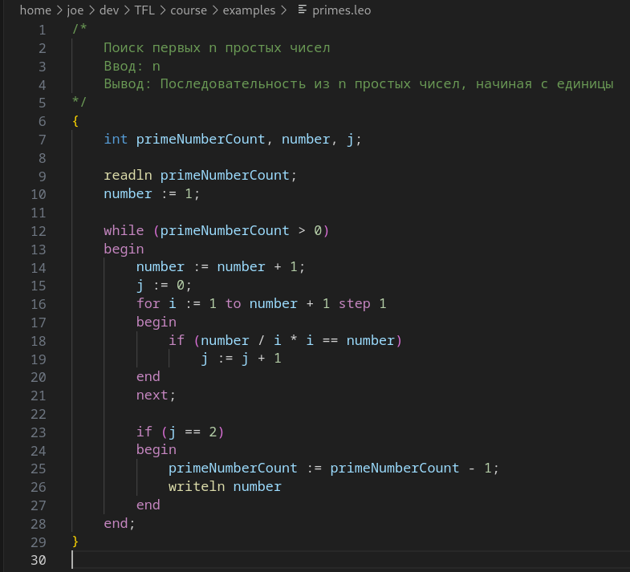{#fig:b_program}

Полученные программы приведены на Рисунках [-@fig:b_result_cpp] - [-@fig:b_result_python].

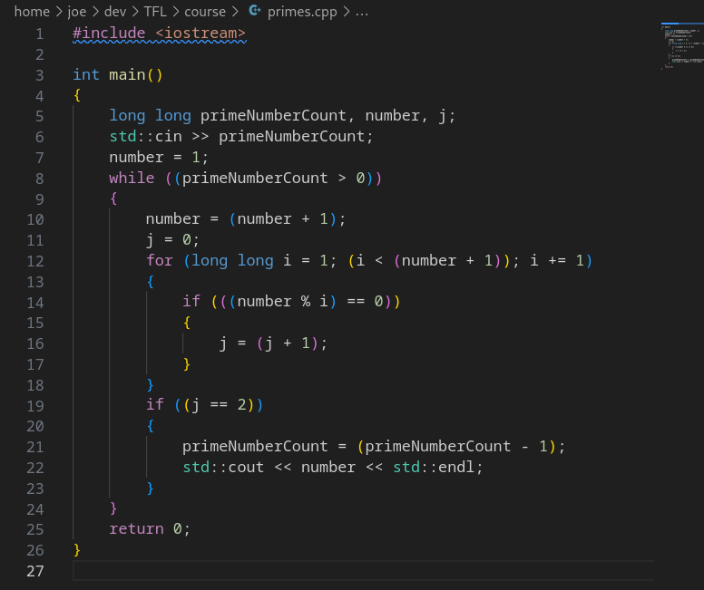{#fig:b_result_cpp}

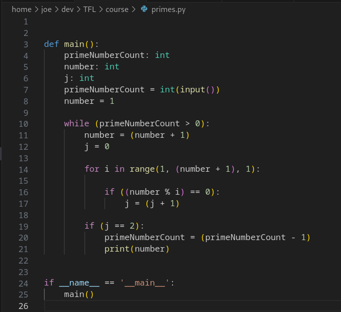{#fig:b_result_python}

Сообщение о результате работы программы приведено на Рисунке [-@fig:b_result_terminal].

{#fig:b_result_terminal}

# Приложение В — Сообщения об ошибках

Примеры сообщений о различных типах ошибок представлены на Рисунках [-@fig:c_1] - [-@fig:c_4].

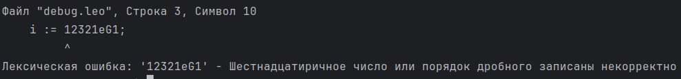{#fig:c_1}

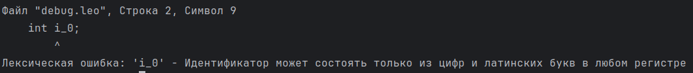{#fig:c_2}

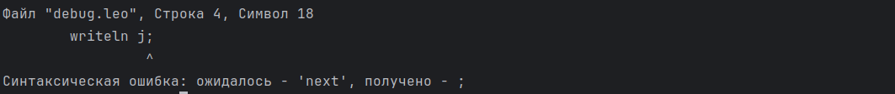{#fig:c_3}

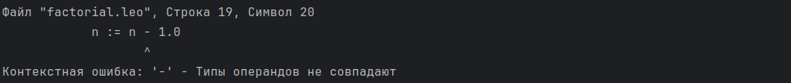{#fig:c_4}

# Приложение Д — Спецификация языка

## Введение

Язык Leo — это учебный транслируемый язык программирования, который может быть использован для несложных линейных
программ с использованием числовых и логических типов данных.

По визуальной оценке, язык заимствует синтаксические конструкции из языков Pascal и c++.

Язык Leo является транслируемым.

Leo умеет транслироваться в Python и c++.

При трансляции в Python поддерживает моментальное исполнение, т.е. не требуется никаких дополнительных действий, связанных с интерпретацией полученной программы.

Так, как язык поддерживает 2 числовых и 1 логический тип, его нельзя назвать языком общего назначения, однако на нём возможно реализовать некоторые расчётные программы.

## Грамматика

Грамматика написана в РБНФ.

{/ ... /} — означает повторение один и более раз.

```{#lst:grammar .txt caption="Исходная грамматика языка"}
<программа>::= '{' {/ (<описание> | <оператор>) ';' /} '}'

<описание>::= <тип> <идентификатор> { ',' <идентификатор> }

<тип>::= 'int' | 'float' | 'bool'

<оператор>::=   <составной> |
                <присваивания> |
                <условный> |
                <фиксированного_цикла> |
                <условного_цикла> |
                <ввода> |
                <вывода>

<составной>::= 'begin' <оператор> { ';' <оператор> } 'end'

<присваивания>::= <идентификатор> ':=' <выражение>

<условный>::= 'if' '(' <выражение> ')' <оператор> ['else' <оператор>]

<фиксированного_цикла>::= 'for' <присваивания> 'to' <выражение> ['step' <выражение>] <оператор> 'next'

<условного_цикла>::= 'while' '(' <выражение> ')' <оператор>

<ввода>::= 'readln' <идентификатор> { ',' <идентификатор> }

<вывода>::= 'writeln' <выражение> { ',' <выражение> }


<выражение> ::= <сумма> { <операции_группы_отношения> <сумма>}

<сумма> ::= <произведение> { <операции_группы_сложения> <произведение>}

<произведение> ::= <множитель> { <операции_группы_умножения> <множитель>}

<множитель> ::= <идентификатор> |
                <число> |
                <логическая_константа> |
                <унарная_операция> <множитель> |
                '(' <выражение> ')'


<логическая_константа>:: = 'true' |
                           'false'

<операции_группы_отношения>::=  '!=' |
                                '==' |
                                '<' |
                                '<=' |
                                '>' |
                                '>='

<операции_группы_сложения>::=   '+' |
                                '-' |
                                '||'

<операции_группы_умножения>::=  '*' |
                                '/' |
                                '&&'

<унарная_операция>::= '!'

<идентификатор> ::= <буква> { <буква> | <цифра> }

<число>::=  <целое> |
            <действительное>

<целое>::=  <двоичное> |
            <восьмеричное> |
            <десятичное> |
            <шестнадцатеричное>

<двоичное>::= {/ '0' | '1' /} ('B' | 'b')

<восьмеричное>::= {/ '0' | '1' | '2' | '3' | '4' | '5' | '6' | '7' /} ('O' | 'o')

<десятичное>::= {/ <цифра> /} ['D' | 'd']

<шестнадцатеричное>::= <цифра> { <цифра> | 'A' | 'B' | 'C' | 'D' | 'E' | 'F' | 'a' | 'b' | 'c' | 'd' | 'e' | 'f' } ('H' | 'h')

<действительное>::= <числовая_строка> <порядок> |
                    [<числовая_строка>] '.' <числовая_строка> [порядок]

<числовая_строка>::= {/ <цифра> /}

<порядок>::= ('E' | 'e')['+' | '-'] <числовая_строка>

<буква> :: =    'a' |
                'b' |
                'c' |
                'd' |
                'e' |
                'f' |
                'g' |
                'h' |
                'i' |
                'j' |
                'k' |
                'l' |
                'm' |
                'n' |
                'o' |
                'p' |
                'q' |
                'r' |
                's' |
                't' |
                'u' |
                'v' |
                'w' |
                'x' |
                'y' |
                'z' |
                'A' |
                'B' |
                'C' |
                'D' |
                'E' |
                'F' |
                'G' |
                'H' |
                'I' |
                'J' |
                'K' |
                'L' |
                'M' |
                'N' |
                'O' |
                'P' |
                'Q' |
                'R' |
                'S' |
                'T' |
                'U' |
                'V' |
                'W' |
                'X' |
                'Y' |
                'Z'

<цифра> ::= '0' |
            '1' |
            '2' |
            '3' |
            '4' |
            '5' |
            '6' |
            '7' |
            '8' |
            '9'
```

## Типы данных

Язык Leo реализует следующие типы данных:

int — целочисленный. Выделяемый объём памяти: 64 бита.

float — вещественный, соответствует двойной точности IEEE 754. Выделяемый объём памяти: 64 бита.

bool — логический, поддерживает значения true и false. Выделяемый объём памяти: 64 бита.

Поведение в случае переполнения целочисленного или вещественного типа данных не определено спецификацией и зависит от реализации на языке, на который производится трансляция.

## Объявления переменных

Любой идентификатор, объявленный в программе, за исключением счётчика цикла for доступен в любом месте программы непосредственно после объявления.

Основная и единственная область видимости — глобальная, объявления разрешено делать только в ней, при этом счётчик цикла "for" доступен только для чтения и не нуждается в объявлении.

Каждый идентификатор, встречающийся в программе должен быть объявлен, за исключением счётчика в **цикле "for"**.

Объявление задаёт постоянные свойства объектов — поддерживаемые операции, о них в разделе выражений.

Использование переменной возможно только после её объявления.

Пример объявления переменных.


```{#lst:a_a1 .txt caption="Пример объявления переменных"}
int i;
float number1, number2;
bool isPrime;
```

**В цикле "for" объявлять переменную не требуется**, смотрите в разделе Оператор "for".

## Оператор присваивания

```{#lst:a_a2 .txt caption="Пример оператора присваивания"}
идентификатор := выражение;
```

Идентификатор должен быть объявлен.

Для всех идентификаторов, кроме счётчика цикла for выражение должно иметь тот же тип, что и переменная.

Для цикла for выражение должно иметь тип int.

## Выражения

Здесь будут приведены лишь языковые особенности выражений, так как по большей части они стандартны.

Разделим операции на группы:

### Арифметические:

```{#lst:a_a3 .txt caption="Арифметические операции"}
+ — сложение
- — вычитание
* — умножение
/ — деление
```

Аргументом арифметических операций должен быть числовой тип (int | float).

Результатом арифметических операции является тип операндов операции "(int + int) -> int".

Типы операндов должны быть одинакового типа "(float + int) -> ошибка".

### Логические

```{#lst:a_a4 .txt caption="Логические операции"}
|| — логическое или
&& — логическое и
```

Аргументом логических выражений должен быть логический тип (bool).

Результатом логических выражений также является логический тип.

### Сравнения

```{#lst:a_a5 .txt caption="Операции сравнения"}
== — равно
!= — не равно
< — меньше
<= — меньше или равно
> — больше
>= — больше или равно
```

Операции сравнения определены только для числовых типов, типы операндов также должны совпадать, выражение вида (float < int) выдадут ошибку.

Результатом операций сравнения является логический тип.

Таким образом можно построить сложные выражения, например:

"121 / 11 * 11 == 121" — будет true.

### Комбинированный оператор

```{#lst:a_a7 .txt caption="Пример комбинированного оператора"}
begin
оператор1;
оператор2;
оператор3
end;
```

Позволяет размещать несколько операторов в телах различных конструкций.
Последний оператор **не должен** заканчиваться символом ';'.

### Операторы ввода/вывода

В языке 2 встроенных оператора ввода/вывода:

readln — оператор ввода, автоматически преобразует ввод к типу переменной.

writeln — оператор вывода.

Примеры:

```{#lst:a_a8 .txt caption="Пример операторов ввода и вывода"}
int x;
float y;
bool z;
readln x, y;
readln z;

writeln x;
writeln x == y, z, 2 + 5;
```

### Оператор if

```{#lst:a_a10 .txt caption="Пример условного оператора"}
if (выражение типа bool)
    код, если выражение истинно
else
    код, если выражение ложно
```

Выражение должно иметь тип bool.

Блок else не зависит от отступов и определяется для последней конструкции if.

Пример плохого оформления программы:

```{#lst:a_a40 .txt caption="Пример плохого тона оформления оператора if"}
{
    int count;
    readln count;
    if (count > 0)
        if (count > 5)
            writeln 5
    else
        writeln count - 5;
}
```

В данном случае результаты работы программы будут следующими:

| Ввод | Вывод  |
|:----:|:------:|
|  -1  | Ничего |
|  1   |   -4   |
|  6   |   5    |

Table: Результат работы программы.

Для улучшения понимания работы программы, блок else следует располагать строко под блоком if, к которому он относится.

```{#lst:a_a11 .txt caption="Пример хорошего тона написания условного оператора"}
{
    int count;
    readln count;
    if (count > 0)
        if (count > 5)
            writeln 5
        else
            writeln count - 5;
}
```

Возникает вопрос — как же отнести блок else к первому блоку if?

Ответ — С помощью составного оператора:

```{#lst:a_a12_1 .txt caption="Пример соотношения блока else к первому условному оператору"}
{
    int count;
    readln count;
    if (count > 0)
        begin
        if (count > 5)
            writeln 5
        end
    else
        writeln count - 5;
}
```

Теперь работа программы будет отличаться от изначального варианта

| Ввод | Вывод  |
|:----:|:------:|
|  -1  |   -6   |
|  1   | Ничего |
|  6   |   5    |

Table: Альтернативный результат работы программы.

### Оператор while

```{#lst:a_13_2 .txt caption="Пример оператора while"}
while (выражение типа bool)
    код, если выражение истинно
```

Выражение должно иметь тип bool.

### Оператор for

```{#lst:a_a13 .txt caption="Пример оператора for"}
for счётчик := выражение_1 to выражение_2 [step выражение_3]
    код...
```

Пример:

```{#lst:a_a12_2 .txt caption="Пример использования оператора for"}
for i := 0 to 5 + 5 step 1 + 2
    код...
```

Счётчик — переменная целочисленного типа, которой присваивается начальное значение — выражение_1, в данном случае — счётчику **i** присваивается значение **0**.

Счётчик объявляется автоматически в новой области видимости с типом int и поэтому **не
должен быть объявлена заранее**. Это позволяет транслировать как на python, так и на c++ без различий в поведении кода.

Счётчик доступен **только для чтения**.

После выхода из вложенности цикла for переменную-счётчик можно считать удалённой.

Выходит, что можно в двух циклах одинакового уровня вложенности использовать одно и то же название счётчика.

```{#lst:a_a12_3 .txt caption="Пример повторного использования названия переменной в циклах"}
for i := 0 to 10
...

for i := 10 to 20
...
```

Выражение_2 — цель, просчитывается каждый раз заново, то есть каждый раз будет выполнена бинарная операция 5 + 5.

Условием цикла является выражение (счётчик < выражение_2), то есть в данном случае (i < 5 + 5).

Выражение3 — выражение, которое будет прибавлено к счётчику каждый раз после выполнения оператора цикла, то есть в данном примере имеет представление i := i + (1 + 2). Каждый раз высчитывается заново.

Все выражения в цикле for должны иметь тип int.

Стоит упомянуть что если необходимо, последнее значение счётчика можно вынести из цикла следующим образом:

```{#lst:a_13_3 .txt caption="Пример выноса значения счётчика из цикла"}
{
    int j;
    for i := 0 to 10
    begin
        writeln i;
        j := i
    end
    next;
    
    int i;
    i := j;
    writeln i;
}
```

### Комментарии

```{#lst:a_a20 .txt caption="Вид комментария"}
/*Комментарий*/
```

### Особенности трансляции

#### Особенности трансляции на язык Python

##### Имена переменных

Имена переменных "input" и "print" зарезервированны, так как необходимы для операций ввода и вывода.

##### Типы данных

Тип int языка Leo представлен типом int.

Тип float языка Leo представлен типом float.

Тип bool языка Leo представлен типом bool.

Переполнение типов int и float языка Leo невозможно, так как Python реализует длинную арифметику.

##### Цикл for

В python цикл for реализуется с использованием range.

Конструкция будет иметь следующий вид:

```{#lst:a_a21 .txt caption="Вид цикла со счётчиком на языке Python"}
for счётчик in range(выражение1, выражение2, выражение3):
    код...
```

##### Оптимизация

Конструкция вида "i / j * j == i" будет заменена на конструкцию "i % j == 0".

При условии, что i и j объявлены как переменные типа int.

#### Особенности трансляции на язык c++

##### Типы данных

Тип int языка Leo представлен типом long long.

Тип float языка Leo представлен типом double.

Тип bool языка Leo представлен типом bool.

Переполнение типов int и float языка Leo возможно и определяется поведением языка c++.

##### Цикл for

Конструкция будет иметь следующий вид:

```{#lst:a_a30 .txt caption="Вид цикла со счётчиком на языке c++"}
for (long long счётчик = выражение_1; счётчик < выражение_2, счётчик += выражение_3)
{
    ...
}
```

##### Оптимизация

Конструкция вида "i / j * j == i" Будет заменена на конструкцию "i % j == 0".

При условии, что i и j объявлены как переменные типа int.
