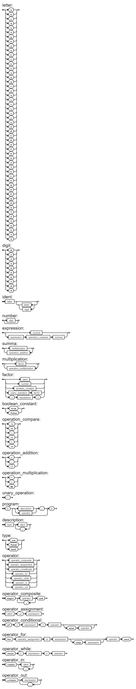

# Введение

Язык Leo - это учебный транслируемый язык программирования, который может быть использован для несложных линейных
программ с использованием числовых и логических типов данных.

По визуальной оценке, язык заимствует синтаксические конструкции из языков Pascal и c++.

Язык Leo является транслируемым.

Leo умеет транслироваться в Python и c++.

При трансляции в Python поддерживает моментальное исполнение, т.е. не требуется никаких дополнительных действий,
связанных с интерпретацией полученной программы.

Так, как язык поддерживает 2 числовых и 1 логический тип, его нельзя назвать языком общего назначения, однако на нём
возможно
реализовать некоторые расчётные программы, пример такой программы приведён
в [Сравнении производительности](./Perfomance_compare.md).

# Грамматика

Грамматика написана в РБНФ.

{/ ... /} - означает повторение один и более раз.

```
<программа>::= '{' {/ (<описание> | <оператор>) ';' /} '}'

<описание>::= <тип> <идентификатор> { ',' <идентификатор> }

<тип>::= 'int' | 'float' | 'bool'

<оператор>::=   <составной> |
                <присваивания> |
                <условный> |
                <фиксированного_цикла> |
                <условного_цикла> |
                <ввода> |
                <вывода>

<составной>::= 'begin' <оператор> { ';' <оператор> } 'end'

<присваивания>::= <идентификатор> ':=' <выражение>

<условный>::= 'if' '(' <выражение> ')' <оператор> ['else' <оператор>]

<фиксированного_цикла>::= 'for' <присваивания> 'to' <выражение> ['step' <выражение>] <оператор> 'next'

<условного_цикла>::= 'while' '(' <выражение> ')' <оператор>

<ввода>::= 'readln' <идентификатор> { ',' <идентификатор> }

<вывода>::= 'writeln' <выражение> { ',' <выражение> }


<выражение> ::= <сумма> { <операции_группы_отношения> <сумма>}

<сумма> ::= <произведение> { <операции_группы_сложения> <произведение>}

<произведение> ::= <множитель> { <операции_группы_умножения> <множитель>}

<множитель> ::= <идентификатор> |
                <число> |
                <логическая_константа> |
                <унарная_операция> <множитель> |
                '(' <выражение> ')'


<логическая_константа>:: = 'true' |
                           'false'

<операции_группы_отношения>::=  '!=' |
                                '==' |
                                '<' |
                                '<=' |
                                '>' |
                                '>='

<операции_группы_сложения>::=   '+' |
                                '-' |
                                '||'

<операции_группы_умножения>::=  '*' |
                                '/' |
                                '&&'

<унарная_операция>::= '!'

<идентификатор> ::= <буква> { <буква> | <цифра> }

<число>::=  <целое> |
            <действительное>

<целое>::=  <двоичное> |
            <восьмеричное> |
            <десятичное> |
            <шестнадцатеричное>

<двоичное>::= {/ '0' | '1' /} ('B' | 'b')

<восьмеричное>::= {/ '0' | '1' | '2' | '3' | '4' | '5' | '6' | '7' /} ('O' | 'o')

<десятичное>::= {/ <цифра> /} ['D' | 'd']

<шестнадцатеричное>::= <цифра> { <цифра> | 'A' | 'B' | 'C' | 'D' | 'E' | 'F' | 'a' | 'b' | 'c' | 'd' | 'e' | 'f' } ('H' | 'h')

<действительное>::= <числовая_строка> <порядок> |
                    [<числовая_строка>] '.' <числовая_строка> [порядок]

<числовая_строка>::= {/ <цифра> /}

<порядок>::= ('E' | 'e')['+' | '-'] <числовая_строка>

<буква> :: =    'a' |
                'b' |
                'c' |
                'd' |
                'e' |
                'f' |
                'g' |
                'h' |
                'i' |
                'j' |
                'k' |
                'l' |
                'm' |
                'n' |
                'o' |
                'p' |
                'q' |
                'r' |
                's' |
                't' |
                'u' |
                'v' |
                'w' |
                'x' |
                'y' |
                'z' |
                'A' |
                'B' |
                'C' |
                'D' |
                'E' |
                'F' |
                'G' |
                'H' |
                'I' |
                'J' |
                'K' |
                'L' |
                'M' |
                'N' |
                'O' |
                'P' |
                'Q' |
                'R' |
                'S' |
                'T' |
                'U' |
                'V' |
                'W' |
                'X' |
                'Y' |
                'Z'

<цифра> ::= '0' |
            '1' |
            '2' |
            '3' |
            '4' |
            '5' |
            '6' |
            '7' |
            '8' |
            '9'
```

Также грамматика, за исключением различных видов чисел изображена с помощью диаграммы Вирта.



# Типы данных

Язык Leo реализует следующие типы данных:

int - целочисленный. Выделяемый объём памяти: 64 бита.

float - вещественный, соответствует двойной точности IEEE 754. Выделяемый объём памяти: 64 бита.

bool - логический, поддерживает значения true и false. Выделяемый объём памяти: 64 бита.

Поведение в случае переполнения целочисленного или вещественного типа данных не определено спецификацией и зависит от
реализации на языке, на который производится трансляция.

# Объявления и области видимости

Любой идентификатор, объявленный в программе, за исключением счётчика цикла for доступен в любом месте программы.

Основная область видимости - глобальная, но также
для каждого счётчика цикла for создаётся **новая область видимости**, при этом счётчик доступен только для чтения.

Каждый идентификатор, встречающийся в программе должен быть объявлен, за исключением счётчика в ***цикле for***

Объявление задаёт постоянные свойства объектов - поддерживаемые операции, о них в разделе Выражения.

Использование переменной возможно только после её объявления.

Пример объявления переменных.

```
int i;
float number1, number2;
bool isPrime;
```

**В цикле for объявлять переменную не требуется**, смотрите в разделе `Оператор for`

## Оператор присваивания

```
идентификатор := выражение;
```

идентификатор должен быть объявлен

допустим для всех идентификаторов, кроме счётчика цикла for

выражение должно иметь тот же тип, что и переменная

# Выражения

Здесь будут приведены лишь языковые особенности выражений, так как по большей части они стандартны.

Разделим операции на группы

## Арифметические:

```
+ - сложение
- - вычитание
* - умножение
/ - деление
```

Аргументом арифметических операций должен быть числовой тип (int | float).

Результатом арифметических операции является тип операндов операции (int + int) -> int.

Типы операндов должны быть одинакового типа (float + int) -> ошибка.

## Логические

```
|| - логическое или
&& - логическое и
```

Аргументом логических выражений должен быть логический тип (bool).

Результатом логических выражений также является логический тип.

## Сравнения

```
== - равно
!= - не равно
< - меньше
<= - меньше или равно
> - больше
>= - больше или равно
```

Операции сравнения определены только для числовых типов, типы операндов также должны совпадать (float < int) -> ошибка.

Результатом операций сравнения является логический тип.

Таким образом можно построить сложные выражения, например

`121 / 11 * 11 == 121` - будет true

## Комбинированный оператор

```
begin
оператор1;
оператор2;
оператор3
end;
```

Позволяет размещать несколько операторов в телах различных конструкций.
Последний оператор **не должен** заканчиваться символом ';'

## Операторы ввода/вывода

В языке 2 встроенных оператора ввода/вывода

readln - оператор ввода, автоматически преобразует ввод к типу переменной.

writeln - оператор вывода.

Примеры:

```
int x;
float y;
bool z;
readln x, y;
readln z;

writeln x;
writeln x == y, z, 2 + 5;
```

## Оператор if

```
if (выражение типа bool)
    код, если выражение истинно
else
    код, если выражение ложно
```

Выражение должно иметь тип bool

Блок else не зависит от отступов и определяется для последней конструкции if

Пример плохого оформления программы:

```lua
{
    int count;
    readln count;
    if (count > 0)
        if (count > 5)
            writeln 5
    else
        writeln count - 5;
}
```

В данном случае результаты работы программы будут следующими:

| Ввод | Вывод  |
|:----:|:------:|
|  -1  | Ничего |
|  1   |   -4   |
|  6   |   5    |

Для улучшения понимания работы программы, блок else следует располагать строко под блоком if, к которому он относится.

```lua
{
    int count;
    readln count;
    if (count > 0)
        if (count > 5)
            writeln 5
        else
            writeln count - 5;
}
```

Возникает вопрос - как же отнести блок else к первому блоку if?

Ответ - С помощью составного оператора:

```lua
{
    int count;
    readln count;
    if (count > 0)
        begin
        if (count > 5)
            writeln 5
        end
    else
        writeln count - 5;
}
```

Теперь работа программы будет отличаться от изначального варианта

| Ввод | Вывод  |
|:----:|:------:|
|  -1  |   -6   |
|  1   | Ничего |
|  6   |   5    |

## Оператор while

```
while (выражение типа bool)
    код, если выражение истинно
```

Выражение должно иметь тип bool

## Оператор for

```
for счётчик := выражение_1 to выражение_2 [step выражение_3]
    код...
```

Пример:

```
for i := 0 to 5 + 5 step 1 + 2
    код...
```

Счётчик - переменная целочисленного типа, которой присваивается начальное значение - выражение_1, в данном случае -
счётчику **i**
присваивается **0**

Счётчик объявляется автоматически в новой области видимости с типом int, однако **не
должен быть объявлена заранее**. Это позволяет транслировать как на python, так и на c++ без казусов и различий в
поведении кода.

Счётчик доступен **только для чтения**

После выхода из вложенности цикла for переменную-счётчик можно считать удалённой.

Выходит, что можно в двух циклах одинакового уровня вложенности использовать одно и то же название счётчика.

```
for i := 0 to 10
...

for i := 10 to 20
...
```

выражение_2 - цель, просчитывается каждый раз заново, то есть каждый раз будет выполнена бинарная операция 5 + 5.

условием цикла является выражение (счётчик < выражение_2), то есть в данном случае (i < 5 + 5).

выражение3 - выражение, которое будет прибавлено к счётчику каждый раз после выполнения оператора цикла, то есть в
данном примере имеет представление i := i + (1 + 2). Каждый раз высчитывается заново.

Все выражения в цикле for должны иметь тип int.

Стоит упомянуть что если необходимо, последнее значение счётчика можно вынести из цикла следующим образом

```
{
    int j;
    for i := 0 to 10
    begin
        writeln i;
        j := i
    end
    next;
    
    int i;
    i := j;
    writeln i;
}
```

## Комментарии

```
/*Комментарий*/
```

## Особенности трансляции

### Трансляция в python

[Особенности](./Python.md)

### Трансляция в c++

[Особенности](./Cpp.md)
